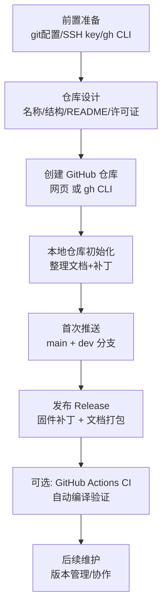

# LOCP 安全机制——GitHub 独立仓库发布流程

> **目标**: 将自定义 LOCP（Loss-of-Control Protection）安全机制的文档、代码补丁发布到 GitHub **独立仓库**
> **为什么独立仓库**: LOCP 是 PX4 上游之外的自定义功能，不应直接推送到 `PX4/PX4-Autopilot` 上游，独立仓库便于版本管理和团队协作
> **文档日期**: 2026-08-03

---

## 目录

1. [发布方案总览](#1-发布方案总览)
2. [仓库设计](#2-仓库设计)
3. [前置准备](#3-前置准备)
4. [创建 GitHub 仓库](#4-创建-github-仓库)
5. [本地仓库初始化与文件组织](#5-本地仓库初始化与文件组织)
6. [首次推送](#6-首次推送)
7. [发布 Release](#7-发布-release)
8. [可选：GitHub Actions 自动化 CI](#8-可选github-actions-自动化-ci)
9. [后续维护流程](#9-后续维护流程)
10. [故障排查 FAQ](#10-故障排查-faq)

---

## 1. 发布方案总览



**关键决策**:

| 决策点 | 建议 | 理由 |
|--------|------|------|
| 仓库是否公开 | 默认 **Private**（含安全机制，发布前需团队评审） | 安全敏感代码 |
| 许可证 | 与 PX4 一致用 **BSD-3-Clause** | 避免许可证冲突 |
| 仓库命名 | `px4-locp` | 简洁、明确 |
| 是否包含完整源码 | 否 —— 只放 **补丁 + 文档** | 避免与 PX4 上游代码仓库混淆 |
| 分支策略 | `main`（稳定）+ `dev`（开发） | 标准 GitHub Flow |

---

## 2. 仓库设计

### 2.1 仓库名称

推荐名称：**`px4-locp`**（PX4 Loss-of-Control Protection）

### 2.2 仓库目录结构

```
px4-locp/
├── README.md                      # 仓库主页说明
├── LICENSE                        # BSD-3-Clause
├── .gitignore                     # 忽略构建产物
├── .github/
│   ├── ISSUE_TEMPLATE/            # Issue 模板
│   │   ├── bug_report.md
│   │   └── feature_request.md
│   └── workflows/                 # CI 工作流（可选）
│       └── build-check.yml
│
├── docs/                          # 文档目录
│   ├── LOCP-失控保护系统说明文档.md      # 核心说明文档
│   ├── 版本升级标准化适配流程.md        # 版本升级适配流程
│   └── README.md                  # 文档索引
│
├── patches/                       # 补丁目录（核心交付物）
│   ├── v1.16.0/                   # 按 PX4 版本分目录
│   │   ├── locp-v1.16.0.patch     # 完整补丁（git format-patch）
│   │   ├── 001-FailsafeFlags.patch
│   │   ├── 002-FailureDetector.patch
│   │   ├── 003-Commander.patch
│   │   ├── 004-Failsafe.patch
│   │   └── 005-Params.patch
│   └── README.md                  # 补丁使用说明
│
├── scripts/                       # 辅助脚本
│   ├── apply-locp-patch.sh        # 自动应用补丁脚本
│   └── generate-patch.sh          # 生成补丁脚本
│
└── CHANGELOG.md                   # 变更日志
```

### 2.3 README.md 模板

```markdown
# PX4 LOCP (Loss-of-Control Protection) 失控保护系统

基于 PX4 v1.16.0 的多维度失控保护安全机制，用于无遥控器/地面站失效场景。

## 功能特性

- 7 维度失控检测: ARD / VRD / PRD / COD / MTO / OBS / Crash
- 三级严重等级仲裁 + 独立 failsafe 通道
- 36+ 可配置参数（全部通过 QGC 调参）
- 基于 PX4 原生 failsafe 框架，安全集成

## 支持版本

| PX4 版本 | 状态 | 分支 |
|----------|------|------|
| v1.16.0 | ✅ 已验证 | locp-v1.16.0 |
| v1.17.0 | 🚧 适配中 | locp-v1.17.0 |

## 快速开始

```bash
# 1. 下载补丁
git clone https://github.com/<your-org>/px4-locp.git
cd px4-locp

# 2. 应用补丁到 PX4 源码
cd ~/PX4-Autopilot
git checkout v1.16.0
git apply ~/px4-locp/patches/v1.16.0/locp-v1.16.0.patch

# 3. 编译
make px4_sitl_default
make cuav_7-nano_default
```

## 文档

- [LOCP 失控保护系统说明文档](docs/LOCP-失控保护系统说明文档.md)
- [版本升级标准化适配流程](docs/版本升级标准化适配流程.md)

## 许可证

BSD-3-Clause
```

---

## 3. 前置准备

### 3.1 配置 git 身份（**必须**，当前是占位符）

```bash
# 当前是占位符，必须改成您的真实信息
git config --global user.name "Your Real Name"
git config --global user.email "your-real-email@example.com"

# 验证
git config --global user.name
git config --global user.email
```

> ⚠️ **注意**: 您机器上当前 git 配置是 `Your Name` / `you@example.com`（默认占位符），发布前必须修改，否则提交记录无法关联到您的 GitHub 账号。

### 3.2 SSH key（已就绪）

```bash
# 您已有 SSH key: ~/.ssh/id_ed25519.pub
# 1. 查看公钥内容
cat ~/.ssh/id_ed25519.pub

# 2. 将公钥添加到 GitHub: 网页 → Settings → SSH and GPG keys → New SSH key
# 3. 测试连接
ssh -T git@github.com
# 应输出: Hi <username>! You've successfully authenticated...
```

### 3.3 安装 gh CLI（可选，推荐）

gh CLI 可以命令行创建仓库，比网页操作更快。

```bash
# Ubuntu/Debian
sudo apt update
sudo apt install gh

# 或使用官方脚本
curl -fsSL https://cli.github.com/packages/githubcli-archive-keyring.gpg | sudo dd of=/usr/share/keyrings/githubcli-archive-keyring.gpg
echo "deb [arch=$(dpkg --print-architecture) signed-by=/usr/share/keyrings/githubcli-archive-keyring.gpg] https://cli.github.com/packages stable main" | sudo tee /etc/apt/sources.list.d/github-cli.list > /dev/null
sudo apt update
sudo apt install gh

# 登录（会打开浏览器授权）
gh auth login
```

---

## 4. 创建 GitHub 仓库

### 4.1 方式 A：网页创建（最简单）

1. 登录 GitHub，点击右上角 **+** → **New repository**
2. 填写：
   - **Repository name**: `px4-locp`
   - **Description**: `PX4 Loss-of-Control Protection safety mechanism`
   - **Visibility**: `Private`（建议）
   - **Initialize this repository with**: 勾选 `Add a README file`（可选）
3. 点击 **Create repository**

### 4.2 方式 B：gh CLI 创建（推荐给开发者）

```bash
# 创建私有仓库（带 README 和 BSD-3-Clause 许可证）
gh repo create px4-locp \
  --private \
  --description "PX4 Loss-of-Control Protection safety mechanism" \
  --license bsd-3-clause \
  --gitignore C \
  --add-readme

# 验证创建成功
gh repo view <your-org>/px4-locp
```

---

## 5. 本地仓库初始化与文件组织

### 5.1 生成 LOCP 补丁（从 PX4 工作区导出）

```bash
# 进入 PX4 工作区
cd ~/PX4-Autopilot

# 1) 生成完整补丁（v1.16.0 基线 → locp 分支）
git diff v1.16.0..locp > /tmp/locp-v1.16.0-full.patch

# 2) 或生成按文件拆分的补丁（更便于审查和选择性应用）
mkdir -p /tmp/locp-patches
git diff v1.16.0..locp -- msg/FailsafeFlags.msg > /tmp/locp-patches/001-FailsafeFlags.patch
git diff v1.16.0..locp -- src/modules/commander/failure_detector/ > /tmp/locp-patches/002-FailureDetector.patch
git diff v1.16.0..locp -- src/modules/commander/Commander.cpp > /tmp/locp-patches/003-Commander.patch
git diff v1.16.0..locp -- src/modules/commander/failsafe/ > /tmp/locp-patches/004-Failsafe.patch

# 3) 确认补丁文件已生成
ls -la /tmp/locp-patches/
```

### 5.2 在本地组织仓库结构

```bash
# 创建独立仓库目录（从 GitHub 克隆，或本地 init）
cd ~
git clone git@github.com:<your-org>/px4-locp.git
cd px4-locp

# 建立目录结构
mkdir -p docs patches/v1.16.0 scripts .github/workflows .github/ISSUE_TEMPLATE

# 1) 复制文档
cp ~/PX4-Autopilot/docs/zh/safety/LOCP-失控保护系统说明文档.md docs/
cp ~/PX4-Autopilot/docs/zh/safety/版本升级标准化适配流程.md docs/

# 2) 复制补丁
cp /tmp/locp-v1.16.0-full.patch patches/v1.16.0/
cp /tmp/locp-patches/*.patch patches/v1.16.0/

# 3) 复制源码改动清单（可选：列出改了哪些文件）
git -C ~/PX4-Autopilot diff v1.16.0..locp --stat > patches/v1.16.0/CHANGED-FILES.txt

# 4) 创建许可证（如果仓库创建时未添加）
cp ~/PX4-Autopilot/LICENSE LICENSE
```

### 5.3 编写 .gitignore

```gitignore
# 构建产物
build/
*.px4
*.elf
*.bin

# 编译缓存
__pycache__/
*.pyc

# IDE
.vscode/
.idea/

# OS
.DS_Store
```

### 5.4 编写补丁应用脚本 `scripts/apply-locp-patch.sh`

```bash
#!/usr/bin/env bash
#
# 自动将 LOCP 补丁应用到 PX4 源码
# 用法: ./apply-locp-patch.sh <px4-src-dir> [px4-version]
#
set -euo pipefail

PX4_DIR="${1:?用法: $0 <px4-src-dir> [px4-version]}"
VERSION="${2:-v1.16.0}"
SCRIPT_DIR="$(cd "$(dirname "$0")" && pwd)"
PATCH_DIR="$SCRIPT_DIR/../patches/$VERSION"

if [ ! -d "$PX4_DIR" ]; then
    echo "错误: PX4 源码目录不存在: $PX4_DIR"
    exit 1
fi

if [ ! -f "$PATCH_DIR/locp-$VERSION.patch" ]; then
    echo "错误: 找不到补丁 $PATCH_DIR/locp-$VERSION.patch"
    exit 1
fi

echo ">>> 确认 PX4 版本..."
(cd "$PX4_DIR" && git describe --tags)

echo ">>> 应用 LOCP 补丁 ($VERSION)..."
if ! (cd "$PX4_DIR" && git apply --check "$PATCH_DIR/locp-$VERSION.patch"); then
    echo "警告: 补丁检查失败，尝试三路合并..."
    (cd "$PX4_DIR" && git apply --3way "$PATCH_DIR/locp-$VERSION.patch")
else
    (cd "$PX4_DIR" && git apply "$PATCH_DIR/locp-$VERSION.patch")
fi

echo ">>> 补丁应用成功！现在可以编译:"
echo "    cd $PX4_DIR && make px4_sitl_default"
```

### 5.5 编写补丁生成脚本 `scripts/generate-patch.sh`

```bash
#!/usr/bin/env bash
#
# 从 PX4 源码生成 LOCP 补丁
# 用法: ./generate-patch.sh <px4-src-dir> <base-tag> <output-dir>
#
set -euo pipefail

PX4_DIR="${1:?用法: $0 <px4-src-dir> <base-tag> <output-dir>}"
BASE_TAG="${2:?缺少 base-tag，如 v1.16.0}"
OUT_DIR="${3:?缺少输出目录}"

mkdir -p "$OUT_DIR"

# 生成完整补丁
git -C "$PX4_DIR" diff "$BASE_TAG"..HEAD > "$OUT_DIR/locp-$BASE_TAG.patch"

# 生成按文件的补丁
for f in \
  msg/FailsafeFlags.msg \
  src/modules/commander/failure_detector/ \
  src/modules/commander/Commander.cpp \
  src/modules/commander/failsafe/; do
    name=$(basename "$f" | tr '/.' '--')
    git -C "$PX4_DIR" diff "$BASE_TAG"..HEAD -- "$f" > "$OUT_DIR/$(basename "$f")-patch.patch" 2>/dev/null || true
done

echo ">>> 补丁已生成到 $OUT_DIR"
ls -la "$OUT_DIR"
```

### 5.6 本地提交

```bash
cd ~/px4-locp
chmod +x scripts/*.sh

git add -A
git status   # 确认所有文件正确

git commit -m "Initial release: LOCP v1.16.0 documentation and patches

- LOCP 失控保护系统完整说明文档
- 版本升级标准化适配流程
- v1.16.0 补丁集（7 维度检测）
- 补丁应用/生成脚本
- BSD-3-Clause 许可证"
```

---

## 6. 首次推送

```bash
cd ~/px4-locp

# 推送到 GitHub（main 分支）
git push -u origin main

# 创建 dev 开发分支
git checkout -b dev
git push -u origin dev

# 切回 main
git checkout main

# 验证
git branch -vv
gh repo view <your-org>/px4-locp   # 如安装了 gh
```

### 推送后验证清单

- [ ] 网页上能看到 `README.md` 渲染
- [ ] `docs/` 目录有 2 份文档
- [ ] `patches/v1.16.0/` 有补丁文件
- [ ] `scripts/` 脚本有执行权限
- [ ] `LICENSE` 存在

---

## 7. 发布 Release

将补丁和文档打包为 Release，方便用户直接下载。

### 7.1 打 tag

```bash
# 创建 v1.16.0 适配版本的 tag
git tag -a v1.16.0-locp -m "LOCP v1.16.0 适配版本"
git push origin v1.16.0-locp
```

### 7.2 创建 Release（gh CLI）

```bash
# 打包补丁
tar czf locp-v1.16.0.tar.gz patches/v1.16.0/ scripts/

# 创建 GitHub Release
gh release create v1.16.0-locp \
  "locp-v1.16.0.tar.gz" \
  --title "LOCP v1.16.0 适配版本" \
  --notes "## LOCP v1.16.0

### 包含内容
- 完整补丁: patches/v1.16.0/locp-v1.16.0.patch
- 按文件补丁: patches/v1.16.0/*.patch
- 应用脚本: scripts/apply-locp-patch.sh

### 变更
- 7 维度失控检测
- 三级等级仲裁 + 独立通道
- 36+ 参数可调"
```

### 7.3 Release Notes 模板

```markdown
## LOCP <版本>

### 新功能
- ...

### 修复
- ...

### 支持版本
- PX4 v1.16.0

### 安装
```bash
git clone https://github.com/<org>/px4-locp.git
cd px4-locp
./scripts/apply-locp-patch.sh ~/PX4-Autopilot v1.16.0
```
```

---

## 8. 可选：GitHub Actions 自动化 CI

在仓库中配置 CI，自动验证补丁能否正确应用到指定 PX4 版本并编译通过。

### 8.1 创建 `.github/workflows/build-check.yml`

```yaml
name: LOCP Patch Build Check

on:
  push:
    branches: [main, dev]
    paths:
      - 'patches/**'
      - 'scripts/**'
  pull_request:
    paths:
      - 'patches/**'
      - 'scripts/**'
  workflow_dispatch:  # 手动触发

jobs:
  build-check:
    strategy:
      matrix:
        px4-version: [v1.16.0]   # 可扩展: [v1.16.0, v1.17.0]
    runs-on: ubuntu-latest
    steps:
      - name: Checkout LOCP repo
        uses: actions/checkout@v4

      - name: Checkout PX4 source
        uses: actions/checkout@v4
        with:
          repository: PX4/PX4-Autopilot
          ref: ${{ matrix.px4-version }}
          path: PX4-Autopilot
          submodules: recursive

      - name: Setup PX4 toolchain
        run: |
          cd PX4-Autopilot
          bash ./Tools/setup/ubuntu.sh --no-nuttx --no-sim-tools
          # 简化环境安装，仅用于编译 SITL

      - name: Apply LOCP patch
        run: |
          ./scripts/apply-locp-patch.sh $GITHUB_WORKSPACE/PX4-Autopilot ${{ matrix.px4-version }}

      - name: Build SITL
        run: |
          cd PX4-Autopilot
          make px4_sitl_default

      - name: Upload build artifacts
        uses: actions/upload-artifact@v4
        with:
          name: locp-${{ matrix.px4-version }}-build
          path: |
            PX4-Autopilot/build/**
```

### 8.2 CI 验证内容

| 检查项 | 说明 |
|--------|------|
| 补丁可应用 | `git apply --check` 通过 |
| SITL 编译 | 无编译错误 |
| 参数生成 | `param show LOCP` 有输出（可加一个 smoke test） |

### 8.3 可选：加一个参数 smoke test

```yaml
      - name: Verify LOCP params exist
        run: |
          cd PX4-Autopilot
          # 检查编译产物中包含 LOCP 参数
          grep -r "LOCP_ARD_EN" build/px4_sitl_default/ 2>/dev/null | head -5 || echo "check params in source"
          grep -c "PARAM_DEFINE.*LOCP" src/modules/commander/failure_detector/failure_detector_params.c
```

---

## 9. 后续维护流程

### 9.1 版本管理

```
分支模型:
main        ← 稳定版（只接受已测试的合并）
  └─ dev    ← 开发分支
      └─ feature/<名称>   ← 功能分支

Tag 规则:
v<px4版本>-locp          ← 每个适配的 PX4 版本
v1.16.0-locp
v1.17.0-locp
```

### 9.2 新版本适配流程（配合《版本升级标准化适配流程》）

```bash
# 1. 在 dev 分支新建适配分支
git checkout dev
git checkout -b adapt/v1.17.0

# 2. 生成 v1.17.0 补丁（在 PX4 工作区）
cd ~/PX4-Autopilot
git checkout locp-v1.17.0
git diff v1.17.0..HEAD > /tmp/locp-v1.17.0.patch

# 3. 提交到适配分支
cd ~/px4-locp
mkdir -p patches/v1.17.0
cp /tmp/locp-v1.17.0.patch patches/v1.17.0/
git add patches/v1.17.0/
git commit -m "Add v1.17.0 patch"

# 4. 合并回 dev，CI 验证
git checkout dev
git merge adapt/v1.17.0
git push

# 5. 验证通过后合并到 main 并打 tag
git checkout main
git merge dev
git tag -a v1.17.0-locp -m "LOCP v1.17.0"
git push origin main --tags
```

### 9.3 协作与 Issue 管理

创建 Issue 模板 `.github/ISSUE_TEMPLATE/bug_report.md`:

```markdown
---
name: Bug 报告
about: 报告 LOCP 问题
title: "[Bug] "
labels: bug
assignees: ''

---

**描述 Bug**
清晰简洁地描述问题。

**触发场景**
- PX4 版本:
- 飞控型号:
- 飞行模式:
- LOCP 参数（如有修改）:

**复现步骤**
1. ...
2. ...

**预期行为**
...

**实际行为**
...

**日志/截图**
附上 .ulg 日志或截图。
```

### 9.4 安全发布建议

| 建议 | 说明 |
|------|------|
| 发布前安全评审 | 涉及飞行安全机制，合入 main 前需至少 2 人 review |
| 补丁签名 | 对 Release 附件做 GPG 签名 `gpg --detach-sign <file>` |
| 保留旧版本 | 每个 PX4 版本的补丁单独目录，不覆盖 |
| 敏感信息 | 确保代码/文档中无内部 IP、密钥 |

---

## 10. 故障排查 FAQ

### Q1: `git push` 报 Permission denied？

**A**: SSH 认证问题。
```bash
# 测试 SSH 连接
ssh -T git@github.com

# 确保 SSH agent 已启动且 key 已添加
eval "$(ssh-agent -s)"
ssh-add ~/.ssh/id_ed25519

# 确认 key 已添加到 GitHub 网页
cat ~/.ssh/id_ed25519.pub
```

### Q2: `git config user.email` 还是占位符？

**A**: 必须修改为真实邮箱（与 GitHub 账号一致），否则提交不会关联到您的账号。
```bash
git config --global user.email "your-real-email@example.com"
git config --global user.name "Your Real Name"
```

### Q3: gh CLI 无法创建仓库？

**A**:
```bash
# 确认已登录
gh auth status

# 未登录则重新登录
gh auth login

# 如 gh 未安装，用网页方式创建（见 4.1）
```

### Q4: 补丁应用到新版本时冲突？

**A**: 遵循《版本升级标准化适配流程》的 VDR + 手动移植方案，不要强制应用冲突补丁。

### Q5: 想把 LOCP 也推给 PX4 上游？

**A**: LOCP 属于自定义功能，推上游需要先发 RFC/讨论。**不要**直接向 `PX4/PX4-Autopilot` 推送，应先在本独立仓库充分验证，再考虑向 PX4 社区提 PR。

---

## 附：发布流程速查命令

```bash
# ===== 前置 =====
git config --global user.name "Your Real Name"
git config --global user.email "your-email@example.com"
ssh -T git@github.com

# ===== 生成补丁（PX4 工作区）=====
cd ~/PX4-Autopilot
git diff v1.16.0..locp > /tmp/locp-v1.16.0.patch

# ===== 创建仓库 =====
gh repo create px4-locp --private --description "PX4 LOCP" --license bsd-3-clause

# ===== 组织内容并推送 =====
cd ~/px4-locp
mkdir -p docs patches/v1.16.0 scripts .github/workflows
cp ~/PX4-Autopilot/docs/zh/safety/*.md docs/
cp /tmp/locp-v1.16.0.patch patches/v1.16.0/
git add -A && git commit -m "Initial release"
git push -u origin main

# ===== 发布 Release =====
git tag -a v1.16.0-locp -m "LOCP v1.16.0"
git push origin v1.16.0-locp
gh release create v1.16.0-locp locp-v1.16.0.tar.gz --title "LOCP v1.16.0"
```

---

> **文档维护者**: LOCP 开发团队
> **更新日期**: 2026-08-03
> **关联文档**: [LOCP-失控保护系统说明文档.md](LOCP-失控保护系统说明文档.md)、[版本升级标准化适配流程.md](版本升级标准化适配流程.md)
