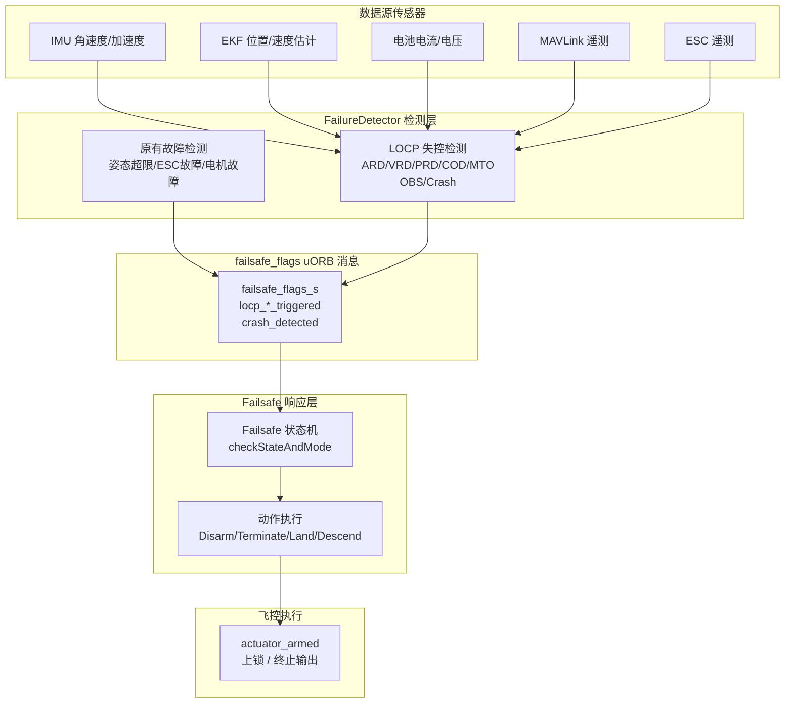

# LOCP (Loss-of-Control Protection) 失控保护系统 — 详细说明文档

> **版本**: v2.1
> **适用范围**: PX4-Autopilot `locp` 分支（cuav_7-nano 定制固件）
> **文档日期**: 2026-08-13

---

## 目录

1. [概述与设计背景](#1-概述与设计背景)
2. [系统架构](#2-系统架构)
3. [检测维度详解](#3-检测维度详解)
   - [3.1 ARD — 姿态变化率检测](#31-ard--姿态变化率检测)
   - [3.2 VRD — 速度变化率检测](#32-vrd--速度变化率检测)
   - [3.3 PRD — 位置变化率检测](#33-prd--位置变化率检测)
   - [3.4 COD — 电流异常检测](#34-cod--电流异常检测)
   - [3.5 MTO — MAVLink 消息超时检测](#35-mto--mavlink-消息超时检测)
   - [3.6 OBS — Offboard Setpoint 异常检测](#36-obs--offboard-setpoint-异常检测)
   - [3.7 Crash — 碰撞/撞击检测](#37-crash--碰撞撞击检测)
   - [3.8 TRD — 动力响应校验](#38-trd--动力响应校验)
4. [保护动作分配](#4-保护动作分配)
   - [4.1 飞机自身健康检查](#41-飞机自身健康检查)
5. [Failsafe 动作集成](#5-failsafe-动作集成)
6. [全部参数说明](#6-全部参数说明)
7. [数据流与触发链路](#7-数据流与触发链路)
8. [MAVLink 遥测与地面站显示](#8-mavlink-遥测与地面站显示)
9. [构建与烧录指南](#9-构建与烧录指南)
10. [SITL 仿真测试指南](#10-sitl-仿真测试指南)
11. [实飞验证与调参建议](#11-实飞验证与调参建议)
12. [故障排查 FAQ](#12-故障排查-faq)

---

## 1. 概述与设计背景

### 1.1 问题场景

在以下场景中，传统 PX4 安全机制可能无法有效保护飞行器：

| 场景 | 传统 failsafe 覆盖情况 | LOCP 覆盖 |
|------|----------------------|----------|
| 遥控器失效（信号丢失） | ✅ RC Loss → RTL/Land | — |
| 地面站断连 | ✅ GCS Loss → RTL/Land | — |
| **无遥控器 + 地面站指令无效** | ❌ 无法检测失控 | ✅ 多维度传感器检测 |
| 传感器故障导致飞行发散 | ❌ 仅 EKF 创新测试，滞后 | ✅ 角加速度/加速度变化率实时检测 |
| 电机/电调突发故障 | ⚠️ 部分（ESC telemetry 超时） | ✅ 电流异常 + dI/dt 尖峰检测 |
| **机载计算机软件 bug 导致异常指令** | ❌ 仅心跳超时检测 | ✅ OBS setpoint 数值跳变/NaN 检测 |
| 空中碰撞/撞击 | ❌ 无检测 | ✅ IMU 加速度范数瞬时触发 |
| 飞控死机/Watchdog 复位 | ❌ 无检测 | ✅ MTO 心跳超时检测 |

### 1.2 设计哲学

LOCP 的核心设计思想是 **"宁可误判、不可漏判"** ——

- 采用 **多维度交叉验证** 降低误报率（单一传感器扰动不会触发）
- 每个检测维度都有独立的 **迟滞滤波器**（Hysteresis）防止瞬时噪声
- 保护动作按"飞机是否受控"**硬编码分配**：飞机自身失控 → 停桨，仅外部输入异常 → 降落（无等级参数）
- 所有触发动作 **禁止用户接管**（`UserTakeoverAllowed::Never`），确保安全关键响应不被人工取消
- 所有阈值可通过 QGroundControl/QGC 或 `param set` 实时调整

### 1.3 涉及的文件清单

| 文件 | 作用 |
|------|------|
| `src/modules/commander/failure_detector/FailureDetector.hpp` | LOCP 检测类头文件，定义所有检测函数接口和内部状态变量 |
| `src/modules/commander/failure_detector/FailureDetector.cpp` | LOCP 核心检测算法实现（~300 行） |
| `src/modules/commander/failure_detector/failure_detector_params.c` | LOCP 全部参数定义（70 个可配置参数） |
| `src/modules/commander/Commander.cpp` | 主循环中 LOCP 标志位同步入口（`Commander::run()`） |
| `src/modules/commander/failsafe/failsafe.h` | Failsafe 类定义与参数声明（LOCP 动作已硬编码，无动作参数） |
| `src/modules/commander/failsafe/failsafe.cpp` | `checkStateAndMode()` 中 LOCP 三级 + 碰撞检测的 CHECK_FAILSAFE 调用 |
| `src/modules/commander/failsafe/framework.h` | FailsafeBase 抽象基类（Action 优先级、ClearCondition、UserTakeover） |
| `src/modules/commander/failsafe/framework.cpp` | FailsafeBase 状态机实现（checkFailsafe、getSelectedAction 等） |
| `msg/FailsafeFlags.msg` | failsafe_flags uORB 消息定义，包含 LOCP 全部标志位 |
| `src/modules/commander/HealthAndArmingChecks/checks/failureDetectorCheck.cpp` | 解锁前检查中集成 fd_critical_failure |

---

## 2. 系统架构

LOCP 作为 PX4 三层安全架构中 **第二层（检测层）** 的扩展，插入到 FailureDetector 中运行，与原有故障检测共用数据源和状态机框架。



**运行时机**:
- `FailureDetector::update()` 在 Commander 主循环中每 ~10ms 调用一次（取决于主循环频率）
- LOCP 检测仅在 `ARMING_STATE_ARMED`（已解锁）状态下运行
- 未解锁时所有 LOCP 标志自动复位

---

## 3. 检测维度详解

### 3.1 ARD — 姿态变化率检测

**Attitude Rate Detection** — 检测飞行器姿态角速度/角加速度的异常变化。

**检测原理**:
1. **角加速度尖峰检测**: 计算 Roll/Pitch/Yaw 三轴角加速度（对前后两帧角速度做差分），任一轴超过阈值即触发
2. **持续高角速率检测**: 任意轴角速率超过设定点且持续超过 `LOCP_ARD_DUR` 秒

```
角加速度(momentary):  |dω/dt| > LOCP_ARD_R_MAX / LOCP_ARD_P_MAX / LOCP_ARD_Y_MAX
持续高角速率:         |ω| > LOCP_ARD_RSP / LOCP_ARD_PSP 且持续时间 > LOCP_ARD_DUR
```

**相关参数**:

| 参数 | 默认值 | 说明 |
|------|--------|------|
| `LOCP_ARD_EN` | 0 | ARD 总开关（默认禁用） |
| `LOCP_ARD_ACC_EN` | 0 | 角加速度尖峰检测开关 |
| `LOCP_ARD_RATE_EN` | 0 | 持续高角速率检测开关 |
| `LOCP_ARD_R_MAX` | 100 rad/s² | Roll 角加速度最大阈值 |
| `LOCP_ARD_P_MAX` | 120 rad/s² | Pitch 角加速度最大阈值 |
| `LOCP_ARD_Y_MAX` | 60 rad/s² | Yaw 角加速度最大阈值 |
| `LOCP_ARD_T` | 0.1 s | 角加速度迟滞确认时间 |
| `LOCP_ARD_RSP` | 2 rad/s | Roll 持续高角速率设定点 |
| `LOCP_ARD_PSP` | 2 rad/s | Pitch 持续高角速率设定点 |
| `LOCP_ARD_YSP` | 5 rad/s | Yaw 持续高角速率设定点 |
| `LOCP_ARD_DUR` | 0.2 s | 持续高角速率最小持续时间 |

---

### 3.2 VRD — 速度变化率检测

**Velocity Rate Detection** — 检测飞行器线速度变化率（加速度）的异常。

**检测原理**:
1. **水平加速度异常**: 水平面合成加速度 `√(ax²+ay²)` 超过阈值
2. **自由落体/动力急降**: 垂直向下加速度 `az` 和垂直下降速度 `vz` 同时超限（双条件 AND）
3. **Jerk（加加速度）检测**: 水平加速度变化率 `|Δa_horiz|/dt` 超过阈值（检测急加速/急减速）

```
水平加速度异常:  √(ax²+ay²) > LOCP_VRD_AH_MAX
自由落体:        az > LOCP_VRD_AD_MAX  AND  vz > LOCP_VRD_VZD_MAX
Jerk异常:        |Δa_horiz|/dt > LOCP_VRD_JERK
```

**相关参数**:

| 参数 | 默认值 | 说明 |
|------|--------|------|
| `LOCP_VRD_EN` | 0 | VRD 总开关（默认禁用） |
| `LOCP_VRD_AH_EN` | 0 | 水平加速度检测开关 |
| `LOCP_VRD_FF_EN` | 0 | 自由落体检测开关 |
| `LOCP_VRD_JK_EN` | 0 | Jerk 检测开关 |
| `LOCP_VRD_HS_EN` | 0 | 水平速度持续异常开关 |
| `LOCP_VRD_AH_MAX` | 55 m/s² | 水平加速度最大阈值 |
| `LOCP_VRD_AD_MAX` | 6 m/s² | 垂直向下加速度阈值（NED Z+） |
| `LOCP_VRD_VZD_MAX` | 3 m/s | 垂直下降速度阈值（配合自由落体判断） |
| `LOCP_VRD_JERK` | 100 m/s³ | 水平 Jerk 阈值 |
| `LOCP_VRD_T` | 0.3 s | 迟滞确认时间 |
| `LOCP_VRD_HS_MAX` | 15 m/s | 水平速度持续异常阈值 |
| `LOCP_VRD_HS_DUR` | 3.0 s | 水平速度持续异常最短时长 |

---

### 3.3 PRD — 位置变化率检测

**Position Rate Detection** — 检测飞行器位置/高度变化率的异常。

**检测原理**:
1. **急降检测**: 垂直下降速度 `vz` 和相对于 Home 点的高度下降量同时超限（双条件 AND）
2. **高度振荡检测**: 维护 10 帧高度数据的环形缓冲，计算滑动窗口标准差，超过阈值判定失控振荡
3. **水平漂移检测**: 水平面合成速度 `√(vx²+vy²)` 超过阈值

```
急降:          vz > LOCP_PRD_VZ_MAX  AND  (z - home.z) > LOCP_PRD_ADROP
高度振荡:      σ_10帧(高度) > LOCP_PRD_ASTD (需要至少5帧数据)
水平漂移:      √(vx²+vy²) > LOCP_PRD_HSPD
```

**相关参数**:

| 参数 | 默认值 | 说明 |
|------|--------|------|
| `LOCP_PRD_EN` | 0 | PRD 总开关（默认禁用） |
| `LOCP_PRD_DES_EN` | 0 | 急降检测开关 |
| `LOCP_PRD_OSC_EN` | 0 | 高度振荡检测开关 |
| `LOCP_PRD_DRF_EN` | 0 | 水平漂移检测开关 |
| `LOCP_PRD_VZ_MAX` | 5 m/s | 垂直下降速度阈值 |
| `LOCP_PRD_ADROP` | 3 m | 高度下降量阈值（相对 Home 点） |
| `LOCP_PRD_ASTD` | 2 m | 高度振荡标准差阈值（10帧滑动窗口） |
| `LOCP_PRD_HSPD` | 5 m/s | 水平漂移速度阈值 |
| `LOCP_PRD_T` | 0.5 s | 迟滞确认时间 |

---

### 3.4 COD — 电流异常检测

**Current Overdraw Detection** — 检测动力系统电流的异常变化。

**检测原理**:
1. **总电流突增**: 维护 20 帧电流数据的环形缓冲，实时比较当前值与滑动均值的偏差；或绝对电流超限
2. **dI/dt 尖峰**: 前后两帧电流差分计算电流变化率，检测瞬间电流尖峰（如电机堵转）

```
总电流突增:       I_now - I_avg_20f > LOCP_COD_DELTA_I  OR  I_now > LOCP_COD_MAX_I
dI/dt尖峰:        |dI/dt| > LOCP_COD_DI_DT
```

**相关参数**:

| 参数 | 默认值 | 说明 |
|------|--------|------|
| `LOCP_COD_EN` | 0 | COD 总开关（默认禁用） |
| `LOCP_COD_SRG_EN` | 0 | 电流突增检测开关 |
| `LOCP_COD_SPK_EN` | 0 | dI/dt 尖峰检测开关 |
| `LOCP_COD_DELTA_I` | 10 A | 总电流偏离滑动均值阈值 |
| `LOCP_COD_MAX_I` | 100 A | 总电流绝对最大阈值 |
| `LOCP_COD_DI_DT` | 300 A/s | 电流变化率 dI/dt 阈值 |
| `LOCP_COD_T` | 0.5 s | 迟滞确认时间 |
| `LOCP_COD_ARM_DLY` | 2.0 s | 解锁后启动保护延迟 |

---

### 3.5 MTO — MAVLink 消息超时检测

**MAVLink Timeout** — 检测 MAVLink 通信链路的中断。

**检测原理**:
1. **心跳超时**: 距最后一次收到 MAVLink 心跳超过 `LOCP_MTO_HB_T` 秒
2. **指令超时**: 距最后一次收到 vehicle_command 超过 `LOCP_MTO_CMD_T` 秒
3. **消息速率骤降**: 1 秒滑动窗口内消息速率低于 `LOCP_MTO_RATE` Hz

**触发条件（逻辑与）**:
- **条件A**: `心跳丢失` —— 单一即触发
- **条件B**: `指令超时 AND 消息速率骤降` —— 需要同时满足

最终 MTO 触发条件 = 条件A OR 条件B。 这样设计的意图是：仅心跳丢失可能只是心跳通道故障，而指令通道和数据通道仍然正常；但若心跳丢失，系统仍然保守地将其视为通信中断。

```
触发MTO:  心跳丢失 OR (指令超时 AND 速率骤降)
```

**相关参数**:

| 参数 | 默认值 | 说明 |
|------|--------|------|
| `LOCP_MTO_EN` | 0 | MTO 总开关（默认禁用） |
| `LOCP_MTO_HB_EN` | 0 | 心跳超时检测开关 |
| `LOCP_MTO_CMD_EN` | 0 | 指令超时检测开关 |
| `LOCP_MTO_HB_T` | 1.5 s | 心跳超时阈值 |
| `LOCP_MTO_CMD_T` | 2.0 s | 指令超时阈值 |
| `LOCP_MTO_RATE` | 3 Hz | 消息最低速率阈值 |

---

### 3.6 OBS — Offboard Setpoint 异常检测

**Offboard Setpoint Sanity** — 检测 MAVROS/机载计算机发送的 trajectory_setpoint 是否存在数值异常。

**背景**: 在 Offboard 模式下，机载计算机通过 MAVLink `SET_POSITION_TARGET_LOCAL_NED` 消息持续向飞控发送 setpoint 指令。 如果机载计算机软件出现 bug（如数值溢出、野指针、ROS 节点间通信异常），可能发送：
- **数值跳变 (Spike)**: setpoint 在相邻帧间剧烈跳动（如位置突然偏移 50m）
- **NaN 注入**: 受控轴的 setpoint 突然变为 NaN（无效浮点数）

现有的 `offboard_control_signal_lost` 只能检测心跳超时，无法检测这种 "心跳正常但数值异常" 的情况。 OBS 填补了这个空白。

**检测原理**:

1. **NaN 注入检测**: 订阅 `trajectory_setpoint` 话题，记录上一帧各轴的有效数值。 如果某轴上一帧有有效数值（非 NaN），而当前帧变为 NaN → 触发异常。

2. **数值跳变检测**: 对于连续两帧都有有效数值的轴，计算变化量并比较阈值：
   - 位置跳变: `|pos_new - pos_old| > LOCP_OBS_JUMP_POS`
   - 速度跳变: `|vel_new - vel_old| > LOCP_OBS_JUMP_VEL`
   - Yaw 跳变: `|yaw_new - yaw_old| > LOCP_OBS_JUMP_YAW`（自动处理 ±PI 环绕）

```
NaN注入:    PX4_ISFINITE(prev) AND !PX4_ISFINITE(curr)  → 异常
位置跳变:  |pos_curr - pos_prev| > LOCP_OBS_JUMP_POS   → 异常
速度跳变:  |vel_curr - vel_prev| > LOCP_OBS_JUMP_VEL   → 异常
Yaw跳变:   |yaw_diff| > LOCP_OBS_JUMP_YAW               → 异常
```

**OBS 触发的动作**:
OBS 是 LOCP 体系中的独立维度，触发后按**飞机自身状态**决定动作：
- 飞机健康（`checkVehicleHealthy` 通过）→ 执行 **降落 (Land)**
- 飞机不健康 → 执行 **停桨 (Disarm)**

OBS 检测到 setpoint 数值跳变/NaN 注入，说明机载计算机软件异常。仅当飞机自身控制可信（姿态/速度正常）时才切换回机载控制降落；若飞机自身也在失控，降落会变成坠机，必须直接停桨。

**OBS 不检测的场景**:
- ❌ 心跳正常但不再发送 setpoint（由 `offboard_control_signal_lost` 检测）
- ❌ 机载计算机过热降频导致控制周期变长（频率变化不在检测范围）
- ❌ MAVROS 崩溃后自动重启（心跳丢失由现有机制检测）
- ✅ **只检测 setpoint 数值本身的合法性**

**数据源**:
OBS 直接订阅 `trajectory_setpoint` uORB 话题。 这个 topic 由 `mavlink_receiver` 在收到 `SET_POSITION_TARGET_LOCAL_NED` MAVLink 消息后发布。

**相关参数**:

| 参数 | 默认值 | 说明 |
|------|--------|------|
| `LOCP_OBS_EN` | 0 | OBS 检测使能开关（默认禁用） |
| `LOCP_OBS_JUMP_POS` | 10 m | 位置跳变阈值 |
| `LOCP_OBS_JUMP_VEL` | 5 m/s | 速度跳变阈值 |
| `LOCP_OBS_JUMP_YAW` | 1.57 rad (~90°) | Yaw 跳变阈值 |
| `LOCP_OBS_T` | 0.3 s | 迟滞确认时间 |

---

### 3.7 Crash — 碰撞/撞击检测

**Crash/Impact Detection** — 检测飞行器是否受到外部碰撞或撞击。

**检测原理**:
- 计算 IMU 三轴加速度范数 `|a| = √(ax²+ay²+az²)`
- 瞬时超过阈值即触发，**无迟滞滤波**（碰撞是瞬时事件，不能等待 confirm time）
- 触发后锁存 2 秒，给予飞控足够的响应时间，然后自动清除

```
碰撞触发:  √(ax²+ay²+az²) > LOCP_CRASH_THR
锁存时间:  触发后持续保持 2 秒，然后自动清除
```

**为什么碰撞检测是独立通道？**

碰撞是瞬时事件，不受迟滞滤波；它的响应动作是 Disarm（上锁），不可延迟、不可接管。 它直接通过 failsafe_flags 中的 `crash_detected` 字段触发，与 ARD/VRD/PRD/COD 一样属于"飞机自身失控 → 停桨"通道。

**相关参数**:

| 参数 | 默认值 | 说明 |
|------|--------|------|
| `LOCP_CRASH_THR` | 70 m/s² (~7.1g) | 加速度范数碰撞阈值 |
| `LOCP_CRASH_EN` | 0 | 碰撞检测使能开关（默认禁用） |

---

### 3.8 TRD — 动力响应校验

**Thrust Response Detection** — 检测"指标矛盾"：油门指令高（期望大推力），但飞机**完全无运动响应**。 覆盖卡网（顶部/侧边）、动力丢失、桨损坏、控制失效。

**检测原理**:
1. **高油门判定**: 油门指令 > `LOCP_TRD_THR_H`（0.85）
2. **完全无响应判定**（2026-08-13 按日志标定：卡网 log_309/311 vs 6-8 月 136 份纯净日志）:
   - 垂直无加速：az > -`LOCP_TRD_AZ_MIN`（无向上加速）
   - 垂直无移动：|vz| < `LOCP_TRD_VZ_MAX`（1.5 m/s，无显著升降——快速升降说明动力正常）
   - 水平无移动：水平速度 < `LOCP_TRD_HS_MAX`（2 m/s，无水平移动——满油门平飞说明动力正常）
   - 高于地面：高度 > `LOCP_TRD_MIN_H`（1m，排除地面解锁/动力测试；6-8 月 5 份地面 arm 调试日志 log_215~219 高度 0.28~0.43m，同样被排除）
3. **确认时间**: 上述矛盾持续 `LOCP_TRD_T`（3s）→ 判定动力无响应

```
动力无响应:  throttle > LOCP_TRD_THR_H   持续 LOCP_TRD_T 秒
              且 az > -LOCP_TRD_AZ_MIN（无向上加速）
              且 |vz| < LOCP_TRD_VZ_MAX（无升降）
              且 水平速度 < LOCP_TRD_HS_MAX（无水平移动）
              且 高度 > LOCP_TRD_MIN_H（高于地面）
```

**数据源注意**:
- az 必须使用 EKF 去重力运动加速度（`vehicle_local_position.az`），**不能**用加速度计原始值——被网卡住时加速度计仍读 1g，无法反映动力无响应

**状态机**:
1. **去抖确认**: 异常条件持续 `LOCP_TRD_T` 秒 → 触发
2. **锁存防空窗**: 确认触发后不因单帧恢复而复位，仅连续正常 3s 才复位（防止撞网空窗期误复位）
3. **分级动作**（由 failsafe 按 `locp_trd_*` 标志执行）:
   - 接管不可用（RC 失联 且 QGC 无指令）→ 立即停桨，不允许接管
   - 高度 ≤ `LOCP_TRD_LAND_H`（5m）→ 请求降落（柔和），允许接管；降落尝试超时 `LOCP_TRD_LTOUT`（4s）→ 转停桨
   - 高度 > 5m / 抛飞 → 直接停桨（允许接管）
   - 接管观察窗口 `LOCP_TRD_WATCH`（3s）：用户接管成功（恢复正常）→ 放行；到期仍无响应 → 强制停桨

**相关参数**:

| 参数 | 默认值 | 说明 |
|------|--------|------|
| `LOCP_TRD_EN` | 0 | TRD 总开关（默认禁用） |
| `LOCP_TRD_THR_H` | 0.85 | 高油门判定阈值（0~1） |
| `LOCP_TRD_T` | 3.0 s | 高油门无响应确认时间 |
| `LOCP_TRD_AZ_MIN` | 5.0 m/s² | 垂直加速度下限 |
| `LOCP_TRD_VZ_MAX` | 1.5 m/s | 垂直速度上限（无显著升降判定） |
| `LOCP_TRD_HS_MAX` | 2.0 m/s | 水平速度上限（无水平移动判定） |
| `LOCP_TRD_MIN_H` | 1.0 m | 最低检测高度（排除地面测试） |
| `LOCP_TRD_LAND_H` | 5.0 m | 低高度降落阈值 |
| `LOCP_TRD_LTOUT` | 4.0 s | 降落尝试超时（超时转停桨） |
| `LOCP_TRD_WATCH` | 3.0 s | 接管观察窗口 |

---

## 4. 保护动作分配

LOCP **不再使用严重等级仲裁**。 各检测维度触发后，由 failsafe 状态机按**固定动作**硬编码执行，行为可预测、无等级参数。

**核心原则：降落的前提是飞机自身受控。**

| 维度 | 飞机自身控制是否可信 | 固定动作 | 原因 |
|------|---------------------|---------|------|
| ARD 姿态变化率 | ❌ 已乱飞 | **停桨 Disarm** | 姿态控制失效，"降落"= 坠机 |
| VRD 速度变化率 | ❌ 速度估计/实际失控 | **停桨 Disarm** | 位置控制依赖速度反馈，降落会乱 |
| PRD 位置变化率 | ❌ 位置估计坏 | **停桨 Disarm** | 降落无法定位 |
| COD 电流异常 | ❌ 动力系统异常 | **停桨 Disarm** | 动力不可靠，降落可能摔 |
| Crash 碰撞 | ❌ 撞击后 | **停桨 Disarm** | 瞬时事件，立即上锁 |
| TRD 动力响应 | ❌ 卡网/动力丢失 | **分级**（低高度降落+接管窗口，高高度/失联停桨） | 见 TRD 章节 |
| MTO 通信超时 | ✅ 仅链路断 | **健康→降落 / 不健康→停桨** | 飞机自身正常才可受控降落 |
| OBS Setpoint 异常 | ✅ 仅机载指令坏 | **健康→降落 / 不健康→停桨** | 飞机自身正常才可受控降落 |

> **关键逻辑**: ARD/VRD/PRD/COD/Crash/TRD 表示**飞机自身已失控**，控制回路输入不可信，此时执行"降落"指令无法可靠落地，必须直接停桨。 MTO/OBS（仅外部输入异常）也要经过**飞机自身健康检查**（`checkVehicleHealthy`）才允许降落：健康→降落，不健康→停桨。
>
> **为什么需要独立健康检查（而非直接看 ARD/VRD 触发标志）**：
> 1. 各检测维度可能被用户禁用（`EN=0`），此时失控不会被标志位反映；
> 2. 失控可能尚未达到维度的"持续确认"阈值（迟滞/DUR 未满）。
> 健康检查是**不受 EN 开关控制的实时状态确认**（角速率 / 水平速度 / 垂直速度 / 数据有效性），补齐这两个盲区。
>
> 多个维度同时触发时，failsafe 状态机自动取**最严格动作**（Disarm 优先级高于 Land），无需额外仲裁逻辑。

### 4.1 飞机自身健康检查（checkVehicleHealthy）

MTO/OBS 触发时，执行降落前必须确认飞机自身受控。 `checkVehicleHealthy()` 是**不受各维度 EN 开关控制的实时状态确认**（即使 ARD/VRD 等检测被禁用也照常运行），任一项异常即判定不健康。

**门槛使用独立参数 `LOCP_HC_*`**（不复用 ARD/VRD/PRD 检测阈值，避免调整检测参数时间接改变健康门槛）：

| 检查项 | 数据源 | 判定条件 | 独立参数 | 覆盖场景 |
|--------|--------|----------|----------|----------|
| Roll/Pitch 角速率 | IMU 角速度 | |ω| 超过 2.0 rad/s | `LOCP_HC_RATE_MAX` | 飞机在乱飞 |
| Yaw 角速率 | IMU 角速度 | |ω_z| 超过 5.0 rad/s | `LOCP_HC_YAW_MAX` | 乱飞（正常 yaw 旋转可达 3.14 rad/s） |
| 水平速度 | EKF local_position | √(vx²+vy²) 超过 15 m/s | `LOCP_HC_HS_MAX` | EGO 视觉故障 |
| 垂直下降速度 | EKF local_position | vz 超过 10 m/s | `LOCP_HC_VZ_MAX` | 急坠 |
| 数据有效性 | — | NaN / 数据不可用 → 保守判不健康 | — | 传感器数据异常 |

**标定依据**（2026-08-13，6-8 月 136 份纯净日志，已排除 EGO 故障/卡网/翻倒/碰撞/地面假速度）：

| 门槛 | 正常样本 P99.9 | 阈值 | 裕度 |
|------|---------------|------|------|
| R/P 角速率 | 1.13 rad/s | 2.0 | 1.8× |
| Yaw 角速率 | 1.38 rad/s | 5.0 | 3.6× |
| 水平速度 | 3.19 m/s | 15 | 4.7× |
| 垂直速度 | 1.04 m/s | 10 | ~5× |

> 注：水平速度评估时排除了 5 份地面假速度日志（log_215~219，地面 arm 调试、EGO 假速度 18~22 m/s、未起飞），否则 P99.9 会被拉到 18.4 m/s。

**为什么需要独立检查（而非直接看 ARD/VRD 触发标志）**:
1. 各检测维度可能被用户禁用（`EN=0`），此时失控不会被标志位反映；
2. 失控可能尚未达到维度的"持续确认"阈值（迟滞/DUR 未满）。

**动作映射**（failsafe 中按 `locp_vehicle_healthy` 复合判断）:
- MTO/OBS 触发 且 健康 → 降落 Land（可安全受控落地）
- MTO/OBS 触发 且 不健康 → 停桨 Disarm（降落会变成坠机）

**动作参数**: `LOCP_L1_ACT / LOCP_L2_ACT / LOCP_L3_ACT / LOCP_OBS_ACT` 已删除，动作全部硬编码（现共 70 个参数）。

---

## 5. Failsafe 动作集成

LOCP 检测结果通过以下链路最终转化为飞控执行动作：

### 5.1 标志位同步（Commander::run()）

```cpp
// Commander.cpp - 主循环中 (~1880行附近)
failsafe_flags_s &locp_flags = _health_and_arming_checks.failsafeFlags();

// 各检测维度触发标志
locp_flags.locp_ard_triggered = _failure_detector.getLOCP_ARD();
locp_flags.locp_vrd_triggered = _failure_detector.getLOCP_VRD();
locp_flags.locp_prd_triggered = _failure_detector.getLOCP_PRD();
locp_flags.locp_cod_triggered = _failure_detector.getLOCP_COD();
locp_flags.locp_mto_triggered = _failure_detector.getLOCP_MTO();
locp_flags.locp_obs_triggered = _failure_detector.getLOCP_OBS();
locp_flags.locp_vehicle_healthy = _failure_detector.getLOCP_VehicleHealthy();
locp_flags.locp_trd_triggered = _failure_detector.getLOCP_TRD();
locp_flags.locp_trd_land      = _failure_detector.getLOCP_TRD_RequestLand();
locp_flags.locp_trd_no_takeover = _failure_detector.getLOCP_TRD_NoTakeover();
locp_flags.crash_detected     = _failure_detector.getCrashDetected();
```

### 5.2 状态机评估（Failsafe::checkStateAndMode()）

```cpp
// failsafe.cpp - checkStateAndMode() 中 (~690行附近)
// 飞机自身失控 → 停桨（不可延迟，不允许接管）
CHECK_FAILSAFE(status_flags, locp_ard_triggered,
    ActionOptions(Action::Disarm).cannotBeDeferred()
    .allowUserTakeover(UserTakeoverAllowed::Never));
CHECK_FAILSAFE(status_flags, locp_vrd_triggered,
    ActionOptions(Action::Disarm).cannotBeDeferred()
    .allowUserTakeover(UserTakeoverAllowed::Never));
CHECK_FAILSAFE(status_flags, locp_prd_triggered,
    ActionOptions(Action::Disarm).cannotBeDeferred()
    .allowUserTakeover(UserTakeoverAllowed::Never));
CHECK_FAILSAFE(status_flags, locp_cod_triggered,
    ActionOptions(Action::Disarm).cannotBeDeferred()
    .allowUserTakeover(UserTakeoverAllowed::Never));
// Crash
CHECK_FAILSAFE(status_flags, crash_detected,
    ActionOptions(Action::Disarm).cannotBeDeferred()
    .allowUserTakeover(UserTakeoverAllowed::Never));
// MTO/OBS 降落安全门槛：飞机健康才降落，不健康停桨
// CHECK_FAILSAFE 宏只接受字段名，此处用 checkFailsafe() 直接传复合条件
const bool land_safe = status_flags.locp_vehicle_healthy;
checkFailsafe(_caller_id_locp_obs_land, ..., locp_obs_triggered && land_safe, Action::Land);
checkFailsafe(_caller_id_locp_obs_disarm, ..., locp_obs_triggered && !land_safe, Disarm);
checkFailsafe(_caller_id_locp_mto_land, ..., locp_mto_triggered && land_safe, Action::Land);
checkFailsafe(_caller_id_locp_mto_disarm, ..., locp_mto_triggered && !land_safe, Disarm);
// TRD 分级（低高度降落 / 高高度停桨，含接管观察窗口）
```

### 5.3 动作说明

- **停桨 Disarm**（ARD/VRD/PRD/COD/Crash）: 不可延迟（`cannotBeDeferred`）、不允许用户接管（`UserTakeoverAllowed::Never`），立即上锁。
- **降落 Land**（MTO/OBS 且飞机健康）: 自动切换到机载控制降落，上锁后清除。仅当飞机自身受控（健康检查通过）时执行。
- **停桨 Disarm**（MTO/OBS 且飞机不健康）: 飞机自身也在失控，降落不安全，直接停桨。
- **TRD 分级**（见 TRD 章节）: 低高度尝试降落（含接管观察窗口），高高度/失联直接停桨。

### 5.4 动作执行（handleModeIntentionAndFailsafe）

```cpp
// Commander.cpp - handleModeIntentionAndFailsafe() 中
switch (_failsafe.selectedAction()) {
case FailsafeBase::Action::Disarm:
    disarm(arm_disarm_reason_t::failsafe, true);  // 强制上锁
    break;
case FailsafeBase::Action::Terminate:
    _vehicle_status.nav_state = NAVIGATION_STATE_TERMINATION;
    // 输出切换到 failsafe 值
    break;
}
```

---

## 6. 全部参数说明

> 以下参数均来自 `failure_detector_params.c`，与固件一致。**所有使能开关默认 = 0（禁用）**，需按需开启。

### 6.1 ARD — 姿态变化率检测参数

| 参数名 | 类型 | 默认值 | 范围 | 单位 | 说明 |
|--------|------|--------|------|------|------|
| `LOCP_ARD_EN` | INT32 | 0 | 0~1 | — | ARD 总开关 |
| `LOCP_ARD_ACC_EN` | INT32 | 0 | 0~1 | — | 角加速度尖峰检测开关 |
| `LOCP_ARD_RATE_EN` | INT32 | 0 | 0~1 | — | 持续高角速率检测开关 |
| `LOCP_ARD_R_MAX` | FLOAT | 100 | 20~500 | rad/s² | Roll 角加速度阈值 |
| `LOCP_ARD_P_MAX` | FLOAT | 120 | 20~500 | rad/s² | Pitch 角加速度阈值 |
| `LOCP_ARD_Y_MAX` | FLOAT | 60 | 20~500 | rad/s² | Yaw 角加速度阈值 |
| `LOCP_ARD_T` | FLOAT | 0.1 | 0.01~2.0 | s | 角加速度迟滞确认时间 |
| `LOCP_ARD_RSP` | FLOAT | 2.0 | 1~30 | rad/s | Roll 持续高角速率设定点 |
| `LOCP_ARD_PSP` | FLOAT | 2.0 | 1~30 | rad/s | Pitch 持续高角速率设定点 |
| `LOCP_ARD_YSP` | FLOAT | 5.0 | 3~30 | rad/s | Yaw 持续高角速率设定点 |
| `LOCP_ARD_DUR` | FLOAT | 0.2 | 0.05~3.0 | s | 持续高角速率最小持续时间 |

### 6.2 VRD — 速度变化率检测参数

| 参数名 | 类型 | 默认值 | 范围 | 单位 | 说明 |
|--------|------|--------|------|------|------|
| `LOCP_VRD_EN` | INT32 | 0 | 0~1 | — | VRD 总开关 |
| `LOCP_VRD_AH_EN` | INT32 | 0 | 0~1 | — | 水平加速度检测开关 |
| `LOCP_VRD_FF_EN` | INT32 | 0 | 0~1 | — | 自由落体检测开关 |
| `LOCP_VRD_JK_EN` | INT32 | 0 | 0~1 | — | Jerk 检测开关 |
| `LOCP_VRD_HS_EN` | INT32 | 0 | 0~1 | — | 水平速度持续异常开关 |
| `LOCP_VRD_AH_MAX` | FLOAT | 55 | 5~100 | m/s² | 水平加速度阈值 |
| `LOCP_VRD_AD_MAX` | FLOAT | 6 | 3~20 | m/s² | 垂直向下加速度阈值 |
| `LOCP_VRD_VZD_MAX` | FLOAT | 3 | 1~15 | m/s | 垂直下降速度阈值 |
| `LOCP_VRD_JERK` | FLOAT | 100 | 20~400 | m/s³ | Jerk 阈值 |
| `LOCP_VRD_T` | FLOAT | 0.3 | 0.1~2.0 | s | 迟滞确认时间 |
| `LOCP_VRD_HS_MAX` | FLOAT | 15 | 1~30 | m/s | 水平速度持续异常阈值 |
| `LOCP_VRD_HS_DUR` | FLOAT | 3.0 | 0.5~5.0 | s | 水平速度持续异常最短时长 |

### 6.3 PRD — 位置变化率检测参数

| 参数名 | 类型 | 默认值 | 范围 | 单位 | 说明 |
|--------|------|--------|------|------|------|
| `LOCP_PRD_EN` | INT32 | 0 | 0~1 | — | PRD 总开关 |
| `LOCP_PRD_DES_EN` | INT32 | 0 | 0~1 | — | 急降检测开关 |
| `LOCP_PRD_OSC_EN` | INT32 | 0 | 0~1 | — | 高度振荡检测开关 |
| `LOCP_PRD_DRF_EN` | INT32 | 0 | 0~1 | — | 水平漂移检测开关 |
| `LOCP_PRD_VZ_MAX` | FLOAT | 5 | 1~20 | m/s | 垂直下降速度阈值 |
| `LOCP_PRD_ADROP` | FLOAT | 3 | 1~50 | m | 高度下降量阈值 |
| `LOCP_PRD_ASTD` | FLOAT | 2 | 0.5~10 | m | 高度振荡标准差阈值 |
| `LOCP_PRD_HSPD` | FLOAT | 5 | 1~30 | m/s | 水平漂移速度阈值 |
| `LOCP_PRD_T` | FLOAT | 0.5 | 0.1~2.0 | s | 迟滞确认时间 |

### 6.4 COD — 电流异常检测参数

| 参数名 | 类型 | 默认值 | 范围 | 单位 | 说明 |
|--------|------|--------|------|------|------|
| `LOCP_COD_EN` | INT32 | 0 | 0~1 | — | COD 总开关 |
| `LOCP_COD_SRG_EN` | INT32 | 0 | 0~1 | — | 电流突增检测开关 |
| `LOCP_COD_SPK_EN` | INT32 | 0 | 0~1 | — | dI/dt 尖峰检测开关 |
| `LOCP_COD_DELTA_I` | FLOAT | 10 | 5~40 | A | 偏离滑动均值阈值 |
| `LOCP_COD_MAX_I` | FLOAT | 100 | 10~200 | A | 总电流绝对阈值 |
| `LOCP_COD_DI_DT` | FLOAT | 300 | 50~1000 | A/s | dI/dt 阈值（单位未入 PX4 白名单，以描述为准） |
| `LOCP_COD_T` | FLOAT | 0.5 | 0.1~2.0 | s | 迟滞确认时间 |
| `LOCP_COD_ARM_DLY` | FLOAT | 2.0 | 0.0~10.0 | s | 解锁后启动保护延迟 |

### 6.5 MTO — MAVLink 超时检测参数

| 参数名 | 类型 | 默认值 | 范围 | 单位 | 说明 |
|--------|------|--------|------|------|------|
| `LOCP_MTO_EN` | INT32 | 0 | 0~1 | — | MTO 总开关 |
| `LOCP_MTO_HB_EN` | INT32 | 0 | 0~1 | — | 心跳超时检测开关 |
| `LOCP_MTO_CMD_EN` | INT32 | 0 | 0~1 | — | 指令超时检测开关 |
| `LOCP_MTO_HB_T` | FLOAT | 1.5 | 0.5~10 | s | 心跳超时阈值 |
| `LOCP_MTO_CMD_T` | FLOAT | 2.0 | 0.5~10 | s | 指令超时阈值 |
| `LOCP_MTO_RATE` | FLOAT | 3.0 | 0.5~50 | Hz | 消息最低速率阈值 |

### 6.6 TRD — 动力响应校验参数

| 参数名 | 类型 | 默认值 | 范围 | 单位 | 说明 |
|--------|------|--------|------|------|------|
| `LOCP_TRD_EN` | INT32 | 0 | 0~1 | — | TRD 总开关 |
| `LOCP_TRD_THR_H` | FLOAT | 0.85 | 0.5~1.0 | norm | 高油门判定阈值（0~1 归一化） |
| `LOCP_TRD_T` | FLOAT | 3.0 | 1.0~5.0 | s | 高油门无响应确认时间 |
| `LOCP_TRD_AZ_MIN` | FLOAT | 5.0 | 1~15 | m/s² | 垂直加速度下限 |
| `LOCP_TRD_VZ_MAX` | FLOAT | 1.5 | 0.5~5.0 | m/s | 垂直速度上限（无显著升降判定） |
| `LOCP_TRD_HS_MAX` | FLOAT | 2.0 | 1~10 | m/s | 水平速度上限（无水平移动判定） |
| `LOCP_TRD_MIN_H` | FLOAT | 1.0 | 0.2~3.0 | m | 最低检测高度（排除地面测试） |
| `LOCP_TRD_LAND_H` | FLOAT | 5.0 | 1~20 | m | 低高度降落阈值 |
| `LOCP_TRD_LTOUT` | FLOAT | 4.0 | 2~10 | s | 降落尝试超时，超时转停桨 |
| `LOCP_TRD_WATCH` | FLOAT | 3.0 | 1~6 | s | 接管观察窗口 |

### 6.7 OBS — Offboard Setpoint 异常检测参数

| 参数名 | 类型 | 默认值 | 范围 | 单位 | 说明 |
|--------|------|--------|------|------|------|
| `LOCP_OBS_EN` | INT32 | 0 | 0~1 | — | OBS 总开关 |
| `LOCP_OBS_JMP_EN` | INT32 | 0 | 0~1 | — | 数值跳变检测开关 |
| `LOCP_OBS_NAN_EN` | INT32 | 0 | 0~1 | — | NaN 注入检测开关 |
| `LOCP_OBS_J_POS` | FLOAT | 10 | 1~50 | m | 位置跳变阈值 |
| `LOCP_OBS_J_VEL` | FLOAT | 5 | 1~20 | m/s | 速度跳变阈值 |
| `LOCP_OBS_J_YAW` | FLOAT | 1.57 | 0.5~6.28 | rad | Yaw 跳变阈值 |
| `LOCP_OBS_T` | FLOAT | 0.3 | 0.1~2.0 | s | 迟滞确认时间 |

### 6.8 碰撞检测参数

| 参数名 | 类型 | 默认值 | 范围 | 单位 | 说明 |
|--------|------|--------|------|------|------|
| `LOCP_CRASH_EN` | INT32 | 0 | 0~1 | — | 碰撞检测使能开关 |
| `LOCP_CRASH_THR` | FLOAT | 70 | 30~200 | m/s² | 加速度范数碰撞阈值 (~7.1g) |

### 6.9 总开关

| 参数名 | 类型 | 默认值 | 范围 | 单位 | 说明 |
|--------|------|--------|------|------|------|
| `LOCP_EN` | INT32 | 0 | 0~1 | — | LOCP 总开关（0=禁用全部） |

### 6.10 飞机自身健康检查参数

| 参数名 | 类型 | 默认值 | 范围 | 单位 | 说明 |
|--------|------|--------|------|------|------|
| `LOCP_HC_RATE_MAX` | FLOAT | 2.0 | 1~10 | rad/s | Roll/Pitch 角速率健康门槛 |
| `LOCP_HC_YAW_MAX` | FLOAT | 5.0 | 1~15 | rad/s | Yaw 角速率健康门槛（正常旋转 180°/s=3.14） |
| `LOCP_HC_HS_MAX` | FLOAT | 15 | 3~30 | m/s | 水平速度健康门槛（1.5×理论最大速度） |
| `LOCP_HC_VZ_MAX` | FLOAT | 10 | 3~20 | m/s | 垂直下降速度健康门槛 |

> **注意**: 等级动作参数 `LOCP_L1_ACT / LOCP_L2_ACT / LOCP_L3_ACT / LOCP_OBS_ACT` 已删除，动作全部硬编码（见第 4 章）。

---

## 7. 数据流与触发链路

### 7.1 完整触发链路（从传感器到动作）

```
时间线（每个 Commander 主循环周期 ~10ms）:

T+0ms    传感器数据更新:
         vehicle_angular_velocity   → ang_vel (100Hz)
         vehicle_local_position     → loc     (50Hz)
         battery_status             → bat     (10Hz)
         esc_status                 → esc     (10Hz)
         telemetry_status           → telemetry
         vehicle_acceleration       → accel   (100Hz)

T+1ms    FailureDetector::update()
         ├─ updateAttitudeStatus()         [原有]
         ├─ updateEscsStatus()             [原有]
         ├─ updateMotorStatus()            [原有]
         ├─ updateImbalancedPropStatus()   [原有]
         └─ updateLOCP()                   [LOCP] ★
             ├─ checkAttitudeRateAnomaly(ang_vel)   → _locp_ard_triggered
             ├─ checkVelocityRateAnomaly(loc)       → _locp_vrd_triggered
             ├─ checkPositionRateAnomaly(loc, home) → _locp_prd_triggered
             ├─ checkCurrentAnomaly(bat)            → _locp_cod_triggered
             ├─ checkMavlinkTimeout()               → _locp_mto_triggered
             ├─ checkOffboardSetpointSanity()       → _locp_obs_triggered
             ├─ checkCrashImpact()                  → _crash_detected
             ├─ checkThrustResponse(status)         → _locp_trd_triggered
             └─ checkVehicleHealthy()               → _locp_vehicle_healthy

T+2ms    Commander::run() — LOCP 标志位同步:
         failsafe_flags.locp_ard_triggered = getLOCP_ARD()
         failsafe_flags.locp_vrd_triggered = getLOCP_VRD()
         failsafe_flags.locp_prd_triggered = getLOCP_PRD()
         failsafe_flags.locp_cod_triggered = getLOCP_COD()
         failsafe_flags.locp_mto_triggered = getLOCP_MTO()
         failsafe_flags.locp_obs_triggered = getLOCP_OBS()
         failsafe_flags.locp_trd_triggered = getLOCP_TRD()
         failsafe_flags.locp_trd_land / no_takeover
         failsafe_flags.crash_detected     = getCrashDetected()

         // 飞机自身健康标志（failsafe 中作为降落安全门槛）:
         locp_vehicle_healthy = getLOCP_VehicleHealthy()

T+3ms    handleModeIntentionAndFailsafe()
         └─ Failsafe::update()
             └─ checkStateAndMode()
                 ├─ CHECK_FAILSAFE(locp_ard_triggered) → Disarm
                 ├─ CHECK_FAILSAFE(locp_vrd_triggered) → Disarm
                 ├─ CHECK_FAILSAFE(locp_prd_triggered) → Disarm
                 ├─ CHECK_FAILSAFE(locp_cod_triggered) → Disarm
                 ├─ CHECK_FAILSAFE(crash_detected)     → Disarm
                 ├─ checkFailsafe(obs_triggered && 健康)      → Land
                 ├─ checkFailsafe(mto_triggered && 健康)      → Land
                 ├─ checkFailsafe(obs_triggered && !健康)     → Disarm
                 ├─ checkFailsafe(mto_triggered && !健康)     → Disarm
                 └─ TRD 分级: 失联→Disarm / 低高度→Land / 高高度→Disarm

T+4ms    getSelectedAction()
         → 选择最高优先级 Action (可能产生 Hold 延迟)

T+5ms    handleModeIntentionAndFailsafe() — 动作执行
         ├─ Action::Disarm    → disarm(failsafe, forced=true)
         └─ Action::Terminate → nav_state = NAVIGATION_STATE_TERMINATION

T+6ms    actuator_armed 发布
         → PWM 输出切换到 failsafe 值 或 上锁
```

### 7.2 所属参数组

所有 LOCP 参数属于 `LOCP` 参数组。在 QGroundControl 的参数页面中，可以按组筛选 "LOCP" 来查看和修改所有 LOCP 相关参数。

---

## 8. MAVLink 遥测与地面站显示

### 8.1 failsafe_flags 消息中的 LOCP 字段

LOCP 检测结果通过 `failsafe_flags` uORB 消息对外暴露，可通过 MAVLink 遥测链路查看。 以下是新增的字段：

```c
// msg/FailsafeFlags.msg — LOCP 相关字段

// --- 各检测维度触发标志 ---
bool locp_ard_triggered       // ARD 姿态变化率异常触发
bool locp_vrd_triggered       // VRD 速度变化率异常触发
bool locp_prd_triggered       // PRD 位置变化率异常触发
bool locp_cod_triggered       // COD 电流异常触发
bool locp_mto_triggered       // MTO MAVLink超时触发
bool locp_obs_triggered       // OBS Offboard Setpoint异常触发
bool locp_vehicle_healthy     // 飞机自身状态健康（MTO/OBS 降落安全门槛，failsafe 中复合判断）
bool locp_trd_triggered       // TRD 动力响应异常触发
bool locp_trd_land            // TRD 低高度请求降落
bool locp_trd_no_takeover     // TRD 接管不可用

// --- 碰撞/撞击检测 ---
bool crash_detected           // 碰撞检测触发
```

### 8.2 在地面站中查看

1. **QGroundControl (QGC)**:
   - 在 `Analyze Tools` → `MAVLink Inspector` 中选择 `FAILSAFE_FLAGS` 消息
   - 或使用 `Widgets` → `Custom Command` 发送 MAVLink 请求

2. **MAVLink Console** (通过 `mavlink_shell.py`):
   ```bash
   # 查看 LOCP 参数
   listener failsafe_flags
   # 查看 LOCP 相关参数
   param show LOCP
   ```

3. **日志分析** (通过 `plotjuggler` 或 `flight_review`):
   - 搜索 `failsafe_flags` topic
   - 绘制 `locp_*_triggered`、`locp_trd_*`、`crash_detected` 等字段

---

## 9. 构建与烧录指南

### 9.1 前置环境要求

在开始之前，请确保已按照 PX4 官方文档完成开发环境搭建：

- **Ubuntu 20.04/22.04**
- **PX4 工具链**: [PX4 Ubuntu 开发环境指南](https://docs.px4.io/main/zh/dev_setup/dev_env_linux_ubuntu.html)

安装必要工具：

```bash
# 克隆 PX4-Autopilot（如果尚未克隆）
cd ~
git clone https://github.com/PX4/PX4-Autopilot.git --recursive
cd PX4-Autopilot

# 切换到 locp 分支（包含 LOCP 安全机制的分支）
git checkout locp

# 更新子模块
git submodule update --init --recursive

# 运行 PX4 环境配置脚本（首次使用）
bash ./Tools/setup/ubuntu.sh
```

### 9.2 支持的飞控硬件

LOCP 安全机制已集成到 Commander 模块中，支持 **所有** PX4 兼容的飞控硬件。 以下为经过测试的硬件平台：

| 飞控 | Build Target | 架构 |
|------|-------------|------|
| CUAV 7-Nano | `make cuav_7-nano_default` | Cortex-M7 (STM32H7) |
| Pixhawk FMUv5 | `make px4_fmu-v5_default` | Cortex-M7 (STM32F7) |
| Pixhawk FMUv6 | `make px4_fmu-v6_default` | Cortex-M7 (STM32H7) |
| CUAV X7 | `make cuav_x7_default` | Cortex-M7 (STM32H7) |
| Holybro Pix32v5 | `make holybro_pix32v5_default` | Cortex-M7 (STM32F7) |
| Cube Orange | `make cubepilot_cubeorange_default` | Cortex-M7 (STM32H7) |
| SITL (仿真) | `make px4_sitl_default` | x86_64 |

### 9.3 构建固件

#### 方式一：命令行构建

```bash
cd ~/PX4-Autopilot

# 以 CUAV 7-Nano 为例
make cuav_7-nano_default

# 构建完成后，固件位于:
# build/cuav_7-nano_default/cuav_7-nano_default.px4
```

#### 方式二：使用 VS Code 构建

1. 在 VS Code 中打开 `~/PX4-Autopilot` 文件夹
2. 按 `Ctrl+Shift+P`，选择 `CMake: Select Configure Preset`
3. 选择对应的飞控目标（如 `cuav_7-nano_default`）
4. 按 `Ctrl+Shift+P`，选择 `CMake: Build`

### 9.4 进入 Bootloader 模式（How to Enter Bootloader）

烧录固件前，飞控必须进入 **Bootloader 模式**。 不同飞控硬件的进入方式略有不同，以下是各主流飞控的详细操作方法：

---

#### 方法一：安全开关/BOOT 按钮法（最常用）

> 适用于：**Pixhawk 4/5/6 系列、CUAV 系列、Cube 系列、Holybro 系列** 等绝大多数 STM32 飞控

**操作步骤**：

1. 确认飞控与电脑之间的 USB 线**未连接**（先拔掉 USB）
2. 找到飞控上的 **安全开关 (Safety Button)** 或 **BOOT 按钮**：

| 飞控型号 | 按钮位置 | 说明 |
|----------|----------|------|
| Pixhawk 4 (FMUv5) | 侧边 **SAFETY** 按钮 | 较长的矩形按钮，旁边有 LED |
| Pixhawk 5X/6X (FMUv5X/v6) | 侧边 **BOOT** 按钮 | 小型圆形按钮，靠近 USB 口 |
| CUAV 7-Nano / X7 | 顶部 **BOOT** 按钮 | 标记为 "BOOT" 的微动开关 |
| Cube Orange | 顶部 **SAFETY** 按钮 | 主接口旁边的安全开关 |
| Holybro Pix32v5/v6 | 侧边 **BOOT** 按钮 | 标记为 "BOOT" 或 "SAFETY" |

3. **按住不放**该按钮
4. **保持按住**的同时，将 USB 线插入飞控和电脑
5. 等待 **2~3 秒**，松开按钮
6. 此时飞控 LED 应快速闪烁或保持常亮（不同飞控表现不同），表示已进入 Bootloader 模式

> :warning: **关键提示**: 一定是**先按住按钮 :arrow_right: 再插 USB**，顺序不能反！

---

#### 方法二：QGroundControl 软件重启法

> 适用于：飞控**当前固件正常运行**、可以通过 USB 连接 QGC 的情况

**操作步骤**：

1. 用 USB 线连接飞控到电脑（正常连接，不需要按按钮）
2. 打开 QGroundControl，确认飞控已连接
3. 进入 `设置` (齿轮图标) :arrow_right: `固件` (Firmware) 页面
4. QGC 会自动检测飞控并弹出固件更新对话框
5. 在对话框中选择 **"高级设置"** :arrow_right: 勾选 **"自定义固件文件"**
6. 选择您编译好的 `.px4` 文件
7. QGC 会自动让飞控重启进入 Bootloader 并完成烧录

> :warning: **注意**: 如果飞控当前固件已损坏无法启动，请用**方法一**或**方法三**。

---

#### 方法三：NSH 命令行重启法

> 适用于：可以通过 **MAVLink Shell** 或 **USB 串口终端** 连接到飞控 NSH 的情况

```bash
# 方式 A: 通过 MAVLink Shell（如果飞控已连接 QGC）
cd ~/PX4-Autopilot
./Tools/mavlink_shell.py

# 在 NSH 终端中执行：
nsh> reboot -b
# 或
nsh> bootloader

# 飞控会立即重启进入 Bootloader 模式
```

```bash
# 方式 B: 通过 USB 串口直接连接
# 先找到飞控的串口设备
ls /dev/ttyACM*

# 使用 screen 或 miniterm 连接
screen /dev/ttyACM0 57600

# 按 Enter 键 3 次，出现 nsh> 提示符后：
nsh> reboot -b
```

> :warning: **注意**: 执行 `reboot -b` 后飞控立即进入 Bootloader，NSH 连接会断开。 此时执行 `make upload` 即可烧录。

---

#### 方法四：MAVLink 命令重启法

> 适用于：可以通过 MAVLink 链路（USB/数传/WiFi）与飞控通信的情况

**使用 pymavlink 发送命令**:

```python
#!/usr/bin/env python3
import pymavlink.mavutil as mavutil

# 连接到飞控
conn = mavutil.mavlink_connection('udpin:0.0.0.0:14550')
conn.wait_heartbeat()

# 发送 reboot to bootloader 命令 (param1=3)
conn.mav.command_long_send(
    conn.target_system, conn.target_component,
    mavutil.mavlink.MAV_CMD_PREFLIGHT_REBOOT_SHUTDOWN,
    0,  # confirmation
    3,  # param1: 3 = reboot to bootloader
    0, 0, 0, 0, 0, 0  # param2-7: unused
)
```

---

#### 方法五：硬件短接法（仅限特定飞控，作为最后手段）

> :warning: **危险操作，仅限有经验的开发者！短路可能导致飞控永久损坏！**

某些飞控在 Bootloader 损坏或按钮失效时，可以通过短接 PCB 上的 BOOT0 引脚强制进入系统 Bootloader：

| 飞控型号 | 短接方法 |
|----------|----------|
| Pixhawk 1 (FMUv2) | 短接 PCB 上的 **BOOT0** 和 **3.3V** 焊盘 |
| Pixracer (FMUv4) | 短接 **BOOT** 和 **RST** 焊盘 |
| CUAV V5+ | 短接 **BOOT0** 排针 |

**操作步骤（通用）**:
1. 彻底断开飞控电源（拔出 USB 和电池）
2. 用镊子或跳线帽短接 BOOT0 引脚
3. 保持短接，插上 USB
4. 等待 3 秒，移除短接
5. 此时飞控进入 STM32 系统 Bootloader（DFU 模式）
6. 使用 STM32CubeProgrammer 或 `dfu-util` 烧录

---

#### 如何确认飞控已进入 Bootloader？

```bash
# 在 Linux 上检查 USB 设备
lsusb

# 如果看到以下任一设备，说明已进入 Bootloader：
# - "STMicroelectronics STM32 BOOTLOADER"  （DFU 模式）
# - "PX4 BL" 或 "3D Robotics PX4"           （PX4 Bootloader）

# 也可以用 dmesg 查看内核日志
dmesg | tail -20

# 正常启动时通常显示为：
#   cdc_acm: USB ACM device
# Bootloader 模式下显示为：
#   usb 1-1: New USB device found, idVendor=0483, idProduct=df11
```

---

### 9.5 烧录固件到飞控

#### 方式一：命令行一键烧录

```bash
cd ~/PX4-Autopilot

# 构建 + 烧录一键完成
make cuav_7-nano_default upload

# 或者分步执行：
# 步骤1: 先构建固件
make cuav_7-nano_default

# 步骤2: 飞控进入 Bootloader（参见 9.4 节）

# 步骤3: 上传固件
make cuav_7-nano_default upload
```

**完整操作流程**：

1. 执行 `make <target>` 编译固件
2. 按 [9.4 节](#94-进入-bootloader-模式how-to-enter-bootloader) 的方法让飞控进入 Bootloader 模式
3. 执行 `make <target> upload` 上传固件
4. 终端显示 `Upload finished` 后，飞控自动重启
5. 等待飞控启动完成（LED 变为正常闪烁模式）

#### 方式二：通过 QGroundControl 烧录

1. 打开 QGroundControl
2. 连接飞控 USB（如飞控已正常运行，QGC 会自动检测并弹出固件更新页）
3. 如 QGC 未自动弹出，进入 `设置` (齿轮图标) :arrow_right: `固件` (Firmware)
4. 在固件页面底部的 **"高级设置"** 中：
   - 勾选 **"自定义固件文件"**
   - 点击浏览，选择 `build/<target>/<target>.px4` 文件
5. 点击 **"确定"** 开始烧录
6. 等待进度条完成，飞控会自动重启

> :bulb: **QGC 方式的优点**: 不需要手动进入 Bootloader，QGC 会通过 MAVLink 命令自动让飞控重启到 Bootloader。

#### 方式三：通过 SD 卡烧录（适用于无法 USB 连接的场景）

```bash
# 1. 将 SD 卡插入电脑读卡器
# 2. 将固件复制到 SD 卡根目录并重命名为 firmware.px4
cp build/cuav_7-nano_default/cuav_7-nano_default.px4 /media/$USER/<SD_CARD_NAME>/firmware.px4

# 3. 将 SD 卡插入飞控
# 4. 上电，飞控会自动检测并烧录
```

> :warning: **注意**: 部分飞控需要在 SD 卡上创建 `/etc/extras.txt` 文件并写入 `set +update` 来启用自动固件更新。

#### 烧录失败的常见原因与解决方案

| 现象 | 原因 | 解决方案 |
|------|------|----------|
| `make upload` 报 `No device found` | 飞控未进入 Bootloader | 检查 USB 连接，重新按方法进入 Bootloader |
| 烧录到一半中断 | USB 线松动或供电不足 | 更换短而粗的 USB 数据线，避免用 USB Hub |
| QGC 找不到飞控 | 飞控固件损坏无法启动 | 使用**方法一**（按钮法）强制进入 Bootloader |
| `Permission denied` | Linux 没有 USB 设备权限 | `sudo usermod -a -G dialout $USER` 后重新登录 |
| 固件上传成功但飞控不启动 | 固件与硬件不匹配 | 确认 build target 正确，检查 `default.px4board` 配置 |

### 9.6 验证固件版本

烧录完成后，通过 MAVLink Console 验证 LOCP 功能是否在固件中：

```bash
# 连接到飞控 MAVLink Shell
./Tools/mavlink_shell.py

# 查看 LOCP 参数
param show LOCP_EN
param show LOCP_ARD_EN
param show LOCP_VRD_EN
param show LOCP_PRD_EN
param show LOCP_COD_EN
param show LOCP_MTO_EN
param show LOCP_TRD_EN
param show LOCP_OBS_EN
param show LOCP_CRASH_EN
param show LOCP_CRASH_THR

# 如果以上参数都存在，说明 LOCP 已正确编译到固件中
```

在 QGroundControl 中:
- 进入 `参数` 页面
- 在搜索框中输入 `LOCP`
- 应看到所有 LOCP 参数（共 70 个）

---

## 10. SITL 仿真测试指南

在实际飞行前，强烈建议先在 SITL 仿真环境中测试 LOCP 功能。

### 10.1 启动 SITL 仿真

```bash
cd ~/PX4-Autopilot

# 启动 jMAVSim 四旋翼仿真
make px4_sitl_default jmavsim

# 或使用 Gazebo-Classic
make px4_sitl_default sitl_gazebo-classic
```

### 10.2 通过故障注入测试 LOCP

LOCP 的故障注入通过 MAVLink 命令 `MAV_CMD_INJECT_FAILURE` 实现：

```bash
# 在新终端中打开 MAVLink Shell
cd ~/PX4-Autopilot
./Tools/mavlink_shell.py
```

**测试 ARD（姿态变化率）**:

由于 SITL 中加速度计数据是仿真生成的，姿态变化率检测的测试可以通过以下方式：

```bash
# 在 QGC 中，使用 Analyze → MAVLink Console 发送命令
# 模拟电机故障以触发 ARD（电机不同步会导致姿态晃动）

# 方法1: 注入电机故障
failure inject --unit=motor --type=off --instance=1

# 方法2: 直接在 MAVLink Shell 中设置参数降低阈值
param set LOCP_ARD_T 0.1          # 缩短迟滞时间
param set LOCP_ARD_R_MAX 5.0      # 降低角加速度阈值
param set LOCP_ARD_RSP 1.0        # 降低持续角速率阈值
param set LOCP_ARD_DUR 0.1        # 缩短持续时间阈值
```

然后通过遥控器（或 QGC 虚拟摇杆）进行剧烈的姿态操作来触发。

**测试 Crash 碰撞检测**:

```bash
# 降低碰撞阈值以方便测试
param set LOCP_CRASH_THR 5.0   # 降低到 5 m/s² (~0.5g)

# 执行着陆或撞击地面
commander land
```

**查看触发状态**:

```bash
# 在 MAVLink Shell 中监听 failsafe_flags
listener failsafe_flags
```

### 10.3 验证响应行为

| 测试场景 | 预期行为 |
|----------|----------|
| ARD/VRD/PRD/COD 阈值设低并触发 | 对应 `locp_*_triggered` 置位 → 立即 Disarm（不可延迟） |
| 碰撞阈值设为很低 + 着陆 | `crash_detected` 触发 → 立即 Disarm |
| 关闭 MAVLink 心跳 | `locp_mto_triggered` 触发 → Land（自动降落） |
| OBS 注入 NaN/跳变 setpoint | `locp_obs_triggered` 触发 → Land |
| 恢复正常 | 动作根据 ClearCondition 清除 |

### 10.4 SITL 中的传感器模拟限制

> ⚠️ **SITL 的限制**: SITL 中的传感器数据是理想化的模拟数据，不能完全反映真实硬件的噪声和漂移特性。LOCP 的阈值在 SITL 中可能过于敏感或过于迟钝。**实飞前务必根据真实飞行日志重新调参**。

---

## 11. 实飞验证与调参建议

### 11.1 首飞建议配置

首次飞行时，建议采用 **保守配置** —— 仅启用警告，不启用自动动作。 这样可以先验证检测准确性，再逐步放开自动响应。

```bash
# === 保守配置 (先开 TRD 降落 + Crash 停桨，其余逐项开启) ===
param set LOCP_EN 1          # 总开关
param set LOCP_TRD_EN 1      # 卡网/动力丢失 → 降落/停桨
param set LOCP_CRASH_EN 1    # 碰撞 → 停桨（安全底线）
# 确认无误报后，再逐项开启 ARD/VRD/OBS 等
```

### 11.2 飞行后日志分析

每次飞行后分析 LOCP 相关日志：

1. 下载飞行日志（通过 QGC 或 SD 卡）
2. 使用 [Flight Review](https://logs.px4.io/) 或 PlotJuggler 打开日志
3. 搜索以下字段并绘图:
   - `failsafe_flags.locp_ard_triggered`
   - `failsafe_flags.locp_vrd_triggered`
   - `failsafe_flags.locp_prd_triggered`
   - `failsafe_flags.locp_cod_triggered`
   - `failsafe_flags.locp_mto_triggered`
   - `failsafe_flags.locp_obs_triggered`
   - `failsafe_flags.locp_trd_triggered`
   - `failsafe_flags.crash_detected`

4. 与飞行视频/时间线对比，验证是否有 **误报** (false positive) 或 **漏报** (false negative)

### 11.3 调参策略

| 问题 | 症状 | 解决方案 |
|------|------|----------|
| **误报 (false positive)** | 正常飞行中 LOCP 触发 | 增大迟滞时间 `LOCP_*_T` 或增大对应阈值 |
| **漏报 (false negative)** | 实际失控但未触发 | 减小阈值或缩短迟滞时间 |
| **特定维度频繁误报** | 如 ARD 在高速机动时频繁触发 | 增大 `LOCP_ARD_R_MAX` 或关闭对应子开关（如 `LOCP_ARD_RATE_EN=0`） |
| **碰撞检测误报** | 着陆时误触发 crash_detected | 增大 `LOCP_CRASH_THR`（当前默认 70 m/s²） |
| **MTO 通信波动误报** | 在信号边缘区 MTO 频繁触发 | 增大 `LOCP_MTO_HB_T`（默认 1.5 → 3 s） |

### 11.4 机型差异化调参

不同机型的正常飞行参数差异很大，需要针对机型调整默认值：

| 机类型 | 建议调整 |
|--------|----------|
| **小型竞速四旋翼** | 增大 ARD 阈值（角速度可达 20+ rad/s），增大 VRD 阈值 |
| **大型航拍六旋翼** | 默认值基本适用，可适当降低 PRD 阈值 |
| **固定翼** | 适当降低 ARD Yaw 阈值，增大 PRD 水平漂移阈值 |
| **VTOL** | 过渡期间自动禁用姿态检测，过渡后不调整也不需要额外配置 |
| **直升机** | 需要重新校准所有阈值（振动特性不同） |

### 11.5 全量日志评估结论（2026-08-13）

对 327 份飞行日志（1-8 月）完成失控识别与阈值覆盖验证，结论如下：

**失控日志识别**（1-2 月部分不作为标定样本，仅 6-8 月参与标定）：

| 类别 | 数量 | 说明 |
|------|------|------|
| EGO 视觉故障（6-8 月） | 13 | log_164~169/182~184/243/244/248/338/345，速度发散 47~107 m/s |
| 卡网事故（7-31） | 2 | log_309/311，碰撞峰值 107/123 m/s² |
| 地面翻倒（7-27） | 1 | log_233，碰撞 105 m/s²、ω>5 rad/s 持续 0.96s |
| 碰撞（7-21） | 1 | log_199，碰撞峰值 77 m/s² |
| 地面假速度（7-22/23） | 5 | log_215~219，未起飞、EGO 假速度 18~22 m/s（非失控，属标定排除样本） |

**阈值裕度验证**（6-8 月 136 份纯净正常日志 × 10 维度）：全部通过（裕度 1.3~11 倍），阈值无需调整：

| 维度 | 阈值 | 正常 P99.9 | 裕度 |
|------|------|-----------|------|
| 角加速度 R/P/Y | 100/120/60 rad/s² | 35.5/31.5/11.8 | 2.8/3.8/5.1× |
| 角速率 R/P / Yaw | 2 / 5 rad/s | 1.13 / 1.38 | 1.8 / 3.6× |
| 水平加速度 | 55 m/s² | 4.95 | 11× |
| 向下加速度 | 6 m/s² | 4.63 | 1.3×（az>6 且 vz>3 交叉样本全量仅 1 个，复合条件保护） |
| 向下速度 | 5 m/s | 0.77 | 6.5× |
| \|vz\| (TRD) | 1.5 m/s | 1.04 | 1.4×（5 条件复合判定保护） |
| 水平速度 | 15 m/s | 3.19 | 4.7× |
| 空中加速度范数 | 70 m/s² | 12.25 | 5.7× |
| jerk | 100 m/s³ | 51.1 | 2.0×（超阈值连续段最长 198ms < 迟滞 0.3s） |
| 降落触地冲击 | 70 m/s² | P99=10.9、Max=61.8 | 不触发 |

**失控日志覆盖验证**：6-8 月 17 份失控日志全部被现有维度捕获：

| 事件 | 捕获维度 |
|------|----------|
| EGO 故障（13 份） | VRD_HS 通道（启用 `LOCP_VRD_HS_EN` 后：47~107 m/s ≫ 15 m/s，持续 3s+）；HC 判定不健康 |
| 卡网 log_309/311 | Crash（107/123 > 70）+ ARD（ω>5 rad/s 持续 0.26s/0.14s > 0.1s） |
| 翻倒 log_233 | Crash（105）+ ARD（ω>5 持续 0.96s） |
| 碰撞 log_199 | Crash（77 > 70） |

> **重要**：1-2 月的 12 份地面翻倒日志（倾角~180°、高度 0m、|ω|>8 rad/s）与 1 月 EGO 故障日志属于失控样本，不参与正常标定，避免污染阈值。

---

## 12. 故障排查 FAQ

### Q1: 烧录后看不到 LOCP 参数？

**A**: 确认以下步骤：
1. 确保烧录的固件是从 `locp` 分支构建的
2. 执行 `param show LOCP_ARD_EN` ——如果返回 `parameter not found`，则固件未正确编译 LOCP
3. 检查 `boards/<target>/default.px4board` 中 `CONFIG_COMMANDER_MODULE=y` 是否存在（Commander 模块为必需）

### Q2: SITL 中 LOCP 没有触发？

**A**:
1. 确保飞机处于**已解锁**状态（`commander takeoff` 或 `commander arm`）
2. 降低对应维度的阈值到合理范围
3. 使用 `listener failsafe_flags` 确认标志位是否变化

### Q3: 如何临时禁用 LOCP？

**A**:
```bash
# 关闭总开关（全部 LOCP 检测与动作失效）
param set LOCP_EN 0

# 或逐个关闭维度开关
param set LOCP_ARD_EN 0
param set LOCP_VRD_EN 0
param set LOCP_PRD_EN 0
param set LOCP_COD_EN 0
param set LOCP_MTO_EN 0
param set LOCP_TRD_EN 0
param set LOCP_OBS_EN 0
param set LOCP_CRASH_EN 0
```

### Q4: 碰撞检测阈值应该设多少？

**A**: 当前默认 70 m/s²（~7.1g），已按 6-8 月 136 份纯净日志重新标定（2026-08-13）：
- 正常飞行范数中位 9.8（1g）、P99.9=12.3 m/s²
- 降落触地冲击（高度≤0.5m）P99=10.9，最高 61.8 m/s²
- 真实卡网碰撞（log_309/311/233）107~123 m/s² 且持续 0.05s+
- **70 m/s² 保证：正常降落不触发，卡网碰撞能触发（裕度约 5.7 倍）**

### Q5: LOCP 触发后如何恢复？

**A**: 取决于触发的动作：
- 停桨 Disarm（ARD/VRD/PRD/COD/Crash、不健康的 MTO/OBS）: 上锁后清除，需重新解锁起飞
- 降落 Land（健康的 MTO/OBS、TRD 低高度）: 上锁后清除
- 各维度触发标志由迟滞滤波器在恢复正常后自动复位
- 若飞机已受损（如卡网后桨叶损坏），需人工检查后再上电飞行

### Q6: OBS 会在哪些情况下误触发？

**A**: 以下场景可能导致 OBS 误触发：
- **参数阈值设置过小**: `LOCP_OBS_JUMP_POS` 设为 1m，如果机载计算机正常发送的 setpoint 轨迹本身就包含大幅机动
- **首次收到 setpoint**: 第一帧 setpoint 的 `_sp_was_valid=false`，OBS 不做跳变检测（冷启动保护）
- **MAVROS 在位置和速度控制之间切换**: 如先发送位置+速度 setpoint，再改为仅发送速度 setpoint。 NaN 注入检测会根据 `PX4_ISFINITE` 做判断

### Q7: OBS 和现有的 `offboard_control_signal_lost` 有什么区别？

**A**:
| 方面 | `offboard_control_signal_lost` | OBS (locp_obs_triggered) |
|------|-------------------------------|--------------------------|
| 检测内容 | MAVLink 心跳超时 | trajectory_setpoint 数值异常 |
| 检测场景 | 机载计算机死机/断连/MAVROS崩溃 | 软件 bug 导致的坏值/跳变/NaN |
| 响应方式 | 模式回退 (Fallback/Land)| 健康→Land / 不健康→Disarm |
| 触发条件 | 500ms 无心跳 | 数值跳变 > 阈值 或 NaN 注入 |

---

## 附录 A: 检测算法伪代码

### ARD 检测伪代码

```
function checkAttitudeRateAnomaly(ang_vel):
    dt = 0.01  // 假设100Hz更新频率

    // 角加速度 = 角速度差分
    d_roll  = |ang_vel.xyz[0] - rollspeed_prev| / dt
    d_pitch = |ang_vel.xyz[1] - pitchspeed_prev| / dt
    d_yaw   = |ang_vel.xyz[2] - yawspeed_prev| / dt

    rollspeed_prev  = ang_vel.xyz[0]
    pitchspeed_prev = ang_vel.xyz[1]
    yawspeed_prev   = ang_vel.xyz[2]

    // 角加速度超限
    accel_fault = d_roll > R_MAX OR d_pitch > P_MAX OR d_yaw > Y_MAX

    // 持续高角速率计时
    if |ang_vel.xyz[0]| > RSP OR |ang_vel.xyz[1]| > PSP OR |ang_vel.xyz[2]| > YSP:
        if att_rate_high_start == 0: att_rate_high_start = now
    else:
        att_rate_high_start = 0

    // 持续高角速率超限
    sustained_high = (|ang_vel.xyz[0]| > RSP OR |ang_vel.xyz[1]| > PSP)
                     AND (now - att_rate_high_start) > ARD_DUR

    // 任意条件满足即认为异常
    triggered = accel_fault OR sustained_high

    // 迟滞滤波
    ard_hysteresis.update(triggered, ARD_T, now)
    return ard_hysteresis.get_state()
```

### TRD 检测伪代码

```
function checkThrustResponse(vehicle_status):
    // 高油门判定
    if throttle > TRD_THR_H:
        // 无向上加速判定（az 为 EKF 去重力加速度）
        if az > -TRD_AZ_MIN:
            if trd_high_thr_start == 0:
                trd_high_thr_start = now
            // 持续 TRD_T 秒 → 触发
            if now - trd_high_thr_start > TRD_T:
                triggered = true
        else:
            // 有向上加速 → 动力正常
            if trd_normal_start == 0:
                trd_normal_start = now
            // 连续正常 3s → 复位（锁存防空窗）
            if now - trd_normal_start > 3.0:
                triggered = false
    else:
        trd_high_thr_start = 0
    return triggered

// 分级动作
if 接管不可用:        → Disarm (立即，不允许接管)
elif height <= LAND_H: → Land (允许接管，超时 LTOUT 转 Disarm)
else:                  → Disarm (允许接管，观察窗口 WATCH)
```

### 飞机自身健康检查伪代码

```
function checkVehicleHealthy():
    // 不受各维度 EN 开关控制，实时状态确认

    // 1) 角速率（IMU 角速度）
    if |ω_roll| > ARD_RSP OR |ω_pitch| > ARD_PSP OR |ω_yaw| > ARD_YSP:
        return false    // 飞机在乱飞
    // 2) 速度（EKF local_position）
    if √(vx²+vy²) > VRD_HS_MAX:   return false  // 水平速度异常
    if vz > 2×PRD_VZ_MAX:         return false  // 急坠
    // 3) 数据有效性
    if NaN 或 数据不可用:          return false  // 保守判不健康

    return true   // 健康 → MTO/OBS 触发时执行降落
```

### 保护动作分配（failsafe 状态机硬编码）

```
// failsafe.cpp - checkStateAndMode()
// 飞机自身失控 → 停桨（不可延迟，不允许接管）
CHECK_FAILSAFE(locp_ard_triggered) → Disarm
CHECK_FAILSAFE(locp_vrd_triggered) → Disarm
CHECK_FAILSAFE(locp_prd_triggered) → Disarm
CHECK_FAILSAFE(locp_cod_triggered) → Disarm
CHECK_FAILSAFE(crash_detected)     → Disarm

// 飞机自身正常 → 降落
checkFailsafe(obs_triggered && 健康) → Land    // OBS 触发 且 飞机健康
checkFailsafe(mto_triggered && 健康) → Land    // MTO 触发 且 飞机健康
checkFailsafe(obs_triggered && !健康) → Disarm  // OBS 触发 且 飞机不健康
checkFailsafe(mto_triggered && !健康) → Disarm  // MTO 触发 且 飞机不健康

// TRD 分级（见 TRD 章节）
if locp_trd_no_takeover:  → Disarm (失联/接管无效)
elif locp_trd_land:       → Land  (低高度)
else:                     → Disarm (高高度，允许接管)
```

> 多个维度同时触发时，failsafe 自动取最严格动作（Disarm 优先于 Land），无需额外仲裁。

---

## 附录 B: 参数速查表

> 完整参数以 `src/modules/commander/failure_detector/failure_detector_params.c` 为准（共 70 个）。**所有使能开关默认 = 0（禁用）**。

| 参数名 | 默认值 | 单位 | 说明 |
|--------|--------|------|------|
| LOCP_EN | 0 | — | LOCP 总开关 |
| LOCP_ARD_EN | 0 | — | ARD 使能 |
| LOCP_ARD_ACC_EN | 0 | — | 角加速度尖峰开关 |
| LOCP_ARD_RATE_EN | 0 | — | 持续高角速率开关 |
| LOCP_ARD_R_MAX | 100 | rad/s² | Roll 角加速度阈值 |
| LOCP_ARD_P_MAX | 120 | rad/s² | Pitch 角加速度阈值 |
| LOCP_ARD_Y_MAX | 60 | rad/s² | Yaw 角加速度阈值 |
| LOCP_ARD_T | 0.1 | s | ARD 迟滞时间 |
| LOCP_ARD_RSP | 2.0 | rad/s | Roll 持续角速率设定点 |
| LOCP_ARD_PSP | 2.0 | rad/s | Pitch 持续角速率设定点 |
| LOCP_ARD_YSP | 5.0 | rad/s | Yaw 持续角速率设定点 |
| LOCP_ARD_DUR | 0.2 | s | 持续角速率最小持续时间 |
| LOCP_VRD_EN | 0 | — | VRD 使能 |
| LOCP_VRD_AH_EN | 0 | — | 水平加速度开关 |
| LOCP_VRD_FF_EN | 0 | — | 自由落体开关 |
| LOCP_VRD_JK_EN | 0 | — | Jerk 开关 |
| LOCP_VRD_HS_EN | 0 | — | 水平速度持续异常开关 |
| LOCP_VRD_AH_MAX | 55 | m/s² | 水平加速度阈值 |
| LOCP_VRD_AD_MAX | 6 | m/s² | 垂直向下加速度阈值 |
| LOCP_VRD_VZD_MAX | 3 | m/s | 垂直下降速度阈值 |
| LOCP_VRD_JERK | 100 | m/s³ | Jerk 阈值 |
| LOCP_VRD_T | 0.3 | s | VRD 迟滞时间 |
| LOCP_VRD_HS_MAX | 15 | m/s | 水平速度持续异常阈值 |
| LOCP_VRD_HS_DUR | 3.0 | s | 水平速度持续异常最短时长 |
| LOCP_PRD_EN | 0 | — | PRD 使能 |
| LOCP_PRD_DES_EN | 0 | — | 急降开关 |
| LOCP_PRD_OSC_EN | 0 | — | 高度振荡开关 |
| LOCP_PRD_DRF_EN | 0 | — | 水平漂移开关 |
| LOCP_PRD_VZ_MAX | 5 | m/s | 急降垂直速度阈值 |
| LOCP_PRD_ADROP | 3 | m | 急降高度下降量阈值 |
| LOCP_PRD_ASTD | 2 | m | 高度振荡标准差阈值 |
| LOCP_PRD_HSPD | 5 | m/s | 水平漂移速度阈值 |
| LOCP_PRD_T | 0.5 | s | PRD 迟滞时间 |
| LOCP_COD_EN | 0 | — | COD 使能 |
| LOCP_COD_SRG_EN | 0 | — | 电流突增开关 |
| LOCP_COD_SPK_EN | 0 | — | dI/dt 尖峰开关 |
| LOCP_COD_DELTA_I | 10 | A | 电流偏离均值阈值 |
| LOCP_COD_MAX_I | 100 | A | 总电流绝对阈值 |
| LOCP_COD_DI_DT | 300 | A/s | dI/dt 阈值 |
| LOCP_COD_T | 0.5 | s | COD 迟滞时间 |
| LOCP_COD_ARM_DLY | 2.0 | s | 解锁后启动保护延迟 |
| LOCP_MTO_EN | 0 | — | MTO 使能 |
| LOCP_MTO_HB_EN | 0 | — | 心跳超时开关 |
| LOCP_MTO_CMD_EN | 0 | — | 指令超时开关 |
| LOCP_MTO_HB_T | 1.5 | s | 心跳超时阈值 |
| LOCP_MTO_CMD_T | 2.0 | s | 指令超时阈值 |
| LOCP_MTO_RATE | 3.0 | Hz | 消息最低速率阈值 |
| LOCP_TRD_EN | 0 | — | TRD 使能 |
| LOCP_TRD_THR_H | 0.85 | — | 高油门判定阈值 |
| LOCP_TRD_T | 3.0 | s | 高油门无响应确认时间 |
| LOCP_TRD_AZ_MIN | 5.0 | m/s² | 垂直加速度下限 |
| LOCP_TRD_LAND_H | 5.0 | m | 低高度降落阈值 |
| LOCP_TRD_LTOUT | 4.0 | s | 降落尝试超时 |
| LOCP_TRD_WATCH | 3.0 | s | 接管观察窗口 |
| LOCP_TRD_VZ_MAX | 1.5 | m/s | 垂直速度上限（无显著升降） |
| LOCP_TRD_HS_MAX | 2.0 | m/s | 水平速度上限（无水平移动） |
| LOCP_TRD_MIN_H | 1.0 | m | 最低检测高度 |
| LOCP_HC_RATE_MAX | 2.0 | rad/s | Roll/Pitch 角速率健康门槛 |
| LOCP_HC_YAW_MAX | 5.0 | rad/s | Yaw 角速率健康门槛 |
| LOCP_HC_HS_MAX | 15 | m/s | 水平速度健康门槛 |
| LOCP_HC_VZ_MAX | 10 | m/s | 垂直下降速度健康门槛 |
| LOCP_OBS_EN | 0 | — | OBS 使能 |
| LOCP_OBS_JMP_EN | 0 | — | 数值跳变开关 |
| LOCP_OBS_NAN_EN | 0 | — | NaN 注入开关 |
| LOCP_OBS_J_POS | 10 | m | 位置跳变阈值 |
| LOCP_OBS_J_VEL | 5 | m/s | 速度跳变阈值 |
| LOCP_OBS_J_YAW | 1.57 | rad | Yaw 跳变阈值 |
| LOCP_OBS_T | 0.3 | s | OBS 迟滞时间 |
| LOCP_CRASH_EN | 0 | — | 碰撞检测使能 |
| LOCP_CRASH_THR | 70 | m/s² | 碰撞加速度阈值 |

---

> **文档维护者**: PX4 LOCP 开发团队
> **更新日期**: 2026-08-13
> **对应分支**: `locp`
> **问题反馈**: 请通过项目 Issue Tracker 提交 Bug 报告或功能建议
