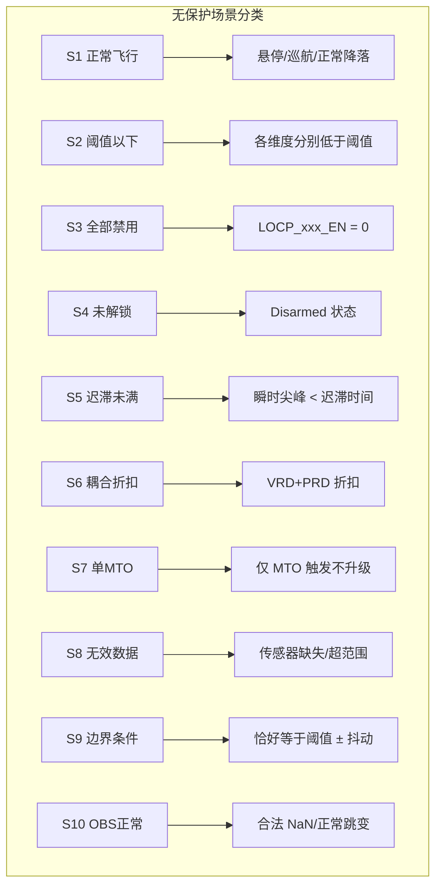

# LOCP 无保护测试场景设计

> **目标**: 验证 LOCP 在 **不应触发保护的场景下正确保持静默**（无误报 / 无 False Positive）
> **测试类型**: 功能正确性验证——确保「没有保护时不乱保护」
> **关联文档**: `px4-locp-design.md`（设计方案）
> **文档日期**: 2026-08-13

---

## 目录

1. [测试目标与范围](#1-测试目标与范围)
2. [测试环境准备](#2-测试环境准备)
3. [场景分类总览](#3-场景分类总览)
4. [S1: 正常飞行不误触发](#4-s1-正常飞行不误触发)
5. [S2: 单个维度阈值以下不触发](#5-s2-单个维度阈值以下不触发)
6. [S3: 全部 EN=0 时不触发](#6-s3-全部-en0-时不触发)
7. [S4: 未解锁状态不触发](#7-s4-未解锁状态不触发)
8. [S5: 迟滞时间未满不触发](#8-s5-迟滞时间未满不触发)
9. [S6: 多维度同时触发取最严格动作](#9-s6-多维度同时触发取最严格动作)
10. [S7: MTO 单维度触发 → 降落](#10-s7-mto-单维度触发--降落)
11. [S8: 数据源无效/缺失不误判](#11-s8-数据源无效缺失不误判)
12. [S9: 边界条件测试](#12-s9-边界条件测试)
13. [S10: OBS 正常 Setpoint 不触发](#13-s10-obs-正常-setpoint-不触发)
14. [测试检查清单 (Checklist)](#14-测试检查清单-checklist)

---

## 1. 测试目标与范围

### 1.1 核心问题

LOCP 新增了 6 个检测维度（ARD/VRD/PRD/COD/MTO/OBS）+ 碰撞检测（Crash）。每个维度都可能因为传感器噪声、正常机动、参数配置不当等原因产生 **误触发**。

**本测试文档聚焦于「无保护」场景**：LOCP 在正常或边缘情况下 **不应该** 触发任何保护动作。

### 1.2 测试矩阵

| 检测维度 | 无保护场景数 | 覆盖要点 |
|----------|:---------:|----------|
| ARD 姿态变化率 | 4 | 正常机动、角速率抖动、加速度低于阈值、迟滞 |
| VRD 速度变化率 | 4 | 正常加速、自由落体条件不全、jerk 低、迟滞 |
| PRD 位置变化率 | 4 | 正常下降、高度稳定、缓冲未满、迟滞 |
| COD 电流异常 | 4 | 正常电流、无效读数、单路正常、迟滞 |
| MTO MAVLink超时 | 4 | 心跳正常、单MTO不升级、速率正常、武装前 |
| OBS Setpoint异常 | 4 | NaN表示不受控、正常跳变、Yaw±π环绕、Offboard未启用 |
| 综合仲裁 | 4 | VRD+PRD折扣、单维不升级、0维不触发、解缴不检测 |

---

## 2. 测试环境准备

### 2.1 SITL 仿真环境

```bash
# 启动 SITL (默认四旋翼 + jMAVSim)
cd ~/PX4-Autopilot
make px4_sitl_default jmavsim

# 或使用 gazebo-classic
make px4_sitl_default sitl_gazebo-classic
```

### 2.2 参数监控命令

```bash
# 监听 LOCP 相关参数
listener failure_detector_status

# 监听 failsafe_flags (LOCP 标志位)
listener failsafe_flags

# 实时查看 LOCP 参数
param show LOCP
```

### 2.3 日志记录（用于事后分析）

```bash
# 启动时开启详细日志
logger on

# 需要关注的 uORB 话题：
# - failure_detector_status (LOCP 各维度触发状态)
# - failsafe_flags (LOCP 标志位)
# - vehicle_local_position (VRD/PRD 数据源)
# - vehicle_angular_velocity (ARD 数据源)
# - battery_status (COD 数据源)
```

---

## 3. 场景分类总览



---

## 4. S1: 正常飞行不误触发

### S1.1 悬停模式

| 项目 | 内容 |
|------|------|
| **目的** | 验证 LOCP 在稳定悬停时所有维度均不触发 |
| **前置条件** | 所有 LOCP_EN=1，四旋翼 SITL，GPS 正常 |
| **测试步骤** | 1. 解锁起飞 → 悬停 30s<br>2. 检查 `failure_detector_status` / `failsafe_flags`<br>3. 检查所有 locp_*_triggered 均为 false |
| **预期结果** | ✅ 所有 locp_*_triggered=false |
| **判定标准** | 悬停过程中无任何 LOCP 标志位置位 |

### S1.2 巡航飞行

| 项目 | 内容 |
|------|------|
| **目的** | 验证正常巡航（含正常加减速和转向）不触发 VRD/PRD/ARD |
| **前置条件** | 所有 LOCP_EN=1 |
| **测试步骤** | 1. 解锁起飞 → 悬停 5s<br>2. 执行正常 Mission 或 Position 模式移动（速度 ≤ 5m/s）<br>3. 执行正常 Yaw 旋转（≤ 180°/s）<br>4. 整个过程监控 LOCP 标志位 |
| **预期结果** | ✅ 所有 locp_*_triggered=false，无任何触发 |
| **判定标准** | 巡航过程中所有 locp_*_triggered 始终为 false |

### S1.3 正常降落 (Land Mode)

| 项目 | 内容 |
|------|------|
| **目的** | 验证正常 Landing 模式下的下降速度和高度变化不触发 PRD/VRD |
| **前置条件** | 所有 LOCP_EN=1，高度 ≥ 10m |
| **测试步骤** | 1. 起飞至 10m 悬停<br>2. 切换到 Land 模式<br>3. 监控降落过程中的 LOCP 标志位直至着陆 |
| **预期结果** | ✅ 正常降落速度 (~0.5~1m/s) 不触发 PRD<br>✅ vz < LOCP_PRD_VZ_MAX(5m/s) |
| **判定标准** | 降落到着陆期间所有 locp_*_triggered 为 false |

---

## 5. S2: 单个维度阈值以下不触发

### S2.1 ARD 姿态变化率——低于阈值

| 项目 | 内容 |
|------|------|
| **目的** | 验证正常机动（角加速度/角速率低于阈值）不触发 ARD |
| **关键参数** | `LOCP_ARD_R_MAX=100 rad/s²`, `LOCP_ARD_RSP=2 rad/s`, `LOCP_ARD_DUR=0.2s` |
| **测试步骤** | 1. 解锁起飞悬停<br>2. 执行小幅 Roll 摇杆输入（角速率 < 2 rad/s，低于设定点）<br>3. 执行小幅 Pitch 机动<br>4. 检查 ARD 不触发 |
| **预期结果** | ✅ `locp_ard_triggered=false` |
| **原理说明** | 角加速度由两帧差分计算（dω/dt），正常机动远低于 100 rad/s² |

### S2.2 VRD 速度变化率——低于阈值

| 项目 | 内容 |
|------|------|
| **目的** | 验证正常加速度/减速度不触发 VRD |
| **关键参数** | `LOCP_VRD_AH_MAX=55 m/s²`, `LOCP_VRD_AD_MAX=6 m/s²`, `LOCP_VRD_JERK=100 m/s³` |
| **测试步骤** | 1. 悬停后缓慢加速至 3m/s（加速度 ~2 m/s²）<br>2. 缓慢减速至悬停<br>3. 检查 VRD 不触发 |
| **预期结果** | ✅ `locp_vrd_triggered=false` |
| **关键** | 正常飞行水平加速度通常 1-3 m/s²，远低于 55 m/s² |

### S2.3 PRD 位置变化率——低于阈值

| 项目 | 内容 |
|------|------|
| **目的** | 验证正常下降 (Land mode / 手动下降) 不触发 PRD |
| **关键参数** | `LOCP_PRD_VZ_MAX=5 m/s`, `LOCP_PRD_ADROP=3 m`, `LOCP_PRD_HSPD=5 m/s` |
| **测试步骤** | 1. 悬停 10m 高度<br>2. 以 1m/s 的速度手动下降 2m（vz < 5, 高度下降 < 3）<br>3. 检查 PRD 不触发 |
| **预期结果** | ✅ `locp_prd_triggered=false` |
| **关键** | PRD 急降需要 vz 和高度下降量**同时满足**，缺一不可 |

### S2.4 COD 电流异常——低于阈值

| 项目 | 内容 |
|------|------|
| **目的** | 验证正常飞行电流波动不触发 COD |
| **关键参数** | `LOCP_COD_DELTA_I=10A`, `LOCP_COD_MAX_I=100A`, `LOCP_COD_DI_DT=300 A/s` |
| **测试步骤** | 1. 悬停状态下监控电池电流<br>2. 确认电流稳定在正常范围（四旋翼悬停通常 5-15A）<br>3. 轻微推油门（电流缓慢变化，dI/dt < 300） |
| **预期结果** | ✅ `locp_cod_triggered=false` |

---

## 6. S3: 全部 EN=0 时不触发

| 项目 | 内容 |
|------|------|
| **目的** | 验证所有 LOCP 维度禁用后，无论飞行状态如何都不触发保护 |
| **前置条件** | 将所有 LOCP_xxx_EN 全部设为 0 |
| **测试步骤** | 1. `param set LOCP_ARD_EN 0`（同样设置 VRD/PRD/COD/MTO/OBS）<br>2. 解锁起飞，执行各种极端机动<br>3. 人为制造大角速率、大加速度、快速下降等<br>4. 监控 LOCP 标志位 |
| **预期结果** | ✅ 所有 locp_*_triggered=false<br>✅ crash_detected=false<br>✅ 不会执行任何 LOCP 保护动作 |
| **判定标准** | 全部 EN=0 时所有标志位始终为 false |

---

## 7. S4: 未解锁状态不触发

### S4.1 地面静止

| 项目 | 内容 |
|------|------|
| **目的** | 验证 Disarmed 状态下 `updateLOCP()` 直接 return，不做任何检测 |
| **实现依据** | `FailureDetector.cpp:512`——`arming_state != ARMED` 时全部重置并 return |
| **测试步骤** | 1. 不接电池/不上电<br>2. 或者接电池但不解锁<br>3. 检查 LOCP 标志位 |
| **预期结果** | ✅ 所有标志位=false |

### S4.2 解锁但未起飞

| 项目 | 内容 |
|------|------|
| **目的** | 验证解锁后、起飞前 LOCP 不会误触发 |
| **测试步骤** | 1. 解锁（ARM）但不推油门<br>2. 电机 idle 旋转 10s<br>3. 监控 LOCP 标志位 |
| **预期结果** | ✅ 地面 idle 状态下各维度不触发（角速度/速度/位置变化均为 0） |

---

## 8. S5: 迟滞时间未满不触发

### S5.1 ARD 瞬时尖峰

| 项目 | 内容 |
|------|------|
| **目的** | 验证短暂的角加速度尖峰（< 迟滞时间）不触发 ARD |
| **关键参数** | `LOCP_ARD_T=0.1s`（角加速度迟滞确认时间） |
| **测试原理** | 传感器噪声或瞬时扰动产生的尖峰通常 < 0.1s，应被迟滞滤波器过滤；实测正常飞行（排除地面翻倒失控样本）连续超阈段最长 0.042s，故迟滞取 0.1s |
| **测试步骤** | 1. 悬停状态下，短时间内（~0.05s）产生一个超过 100 rad/s² 的角加速度尖峰<br>2. 检查 ARD 在尖峰消失后是否复位 |
| **预期结果** | ✅ `locp_ard_triggered` 在尖峰消失后 0.1s 内复位<br>✅ 不会触发停桨动作 |
| **判定标准** | 瞬时尖峰不产生持续的 ARD 触发状态 |

### S5.2 各维度迟滞验证

| 维度 | 迟滞参数 | 默认值 | 瞬时故障持续 | 预期 |
|------|----------|--------|:----------:|------|
| ARD | `LOCP_ARD_T` | 0.1s | 0.05s | ✅ 不触发 |
| VRD | `LOCP_VRD_T` | 0.3s | 0.2s | ✅ 不触发 |
| PRD | `LOCP_PRD_T` | 0.5s | 0.3s | ✅ 不触发 |
| COD | `LOCP_COD_T` | 0.5s | 0.3s | ✅ 不触发 |
| OBS | `LOCP_OBS_T` | 0.3s | 0.2s | ✅ 不触发 |

---

## 9. S6: 多维度同时触发取最严格动作

### S6.1 ARD + COD 同时触发 → 停桨

| 项目 | 内容 |
|------|------|
| **目的** | 验证多个维度同时触发时，failsafe 自动取最严格动作（Disarm 优先于 Land） |
| **实现依据** | `failsafe.cpp`——各维度独立 CHECK_FAILSAFE，failsafe 框架按 Action 优先级取最高 |
| **测试场景** | 同时制造姿态异常 + 电流异常（独立数据源） |
| **前置条件** | LOCP 全部启用 |
| **测试步骤** | 1. 悬停中同时模拟 ARD（大角速率）和 COD（电流突增）<br>2. 监控 failsafe_flags |
| **预期结果** | ✅ `locp_ard_triggered=true` 且 `locp_cod_triggered=true`<br>✅ failsafe 选择 Disarm（最严格动作） |
| **判定标准** | 多维度同时触发时动作优先级正确（Disarm > Land） |

---

## 10. S7: MTO 单维度触发 → 降落

### S7.1 MTO 触发验证

| 项目 | 内容 |
|------|------|
| **目的** | 验证仅 MAVLink 超时（MTO）触发时，执行 Land（飞机自身正常，可安全降落） |
| **实现依据** | `failsafe.cpp`——`CHECK_FAILSAFE(status_flags, locp_mto_land, Action::Land)`（健康）`+ locp_mto_disarm → Disarm`（不健康） |
| **测试步骤** | 1. 悬停飞行中，断开 GCS（MAVLink）连接<br>2. 仅 MTO 触发，其他维度均正常<br>3. 监控 failsafe_flags 与导航状态 |
| **预期结果** | ✅ `locp_mto_triggered=true`<br>✅ failsafe 选择 Land（自动降落）<br>✅ 不会停桨（飞机自身正常） |
| **判定标准** | 仅 MTO 触发 且 飞机健康 → 降落；飞机不健康 → 停桨 |

### S7.2 MTO + ARD 同时触发 → 停桨（最严格动作）

| 项目 | 内容 |
|------|------|
| **目的** | MTO 触发的同时出现 ARD 失控，应升级为停桨（ARD 的 Disarm 优先于 MTO 的 Land） |
| **测试步骤** | 1. 悬停后断开 GCS（MTO 触发）<br>2. 同时制造 ARD 异常（如模拟大角速率）<br>3. 监控 failsafe_flags 与动作 |
| **预期结果** | ✅ `locp_ard_triggered=true`<br>✅ failsafe 选择 Disarm（最严格动作） |
| **说明** | 此为正例对照，验证动作优先级在叠加场景下正确 |

---

## 11. S8: 数据源无效/缺失不误判

### S8.1 电池电流无效数据

| 项目 | 内容 |
|------|------|
| **目的** | 验证电池电流读数异常时 COD 不误触发 |
| **实现依据** | `FailureDetector.cpp:738`——`if (bat.current_a < -0.5f || bat.current_a > 200.f) return false` |
| **测试步骤** | 1. 模拟电流传感器输出 -10A（负值）或 250A（超范围）<br>2. 检查 COD 是否触发 |
| **预期结果** | ✅ COD 直接返回 false（数据无效，跳过检测） |

### S8.2 无 IMU 数据时不触发 ARD

| 项目 | 内容 |
|------|------|
| **目的** | 验证 vehicle_angular_velocity 话题无更新时 ARD 不触发 |
| **实现依据** | `FailureDetector.cpp:528`——`if (_vehicle_angular_velocity_sub.update(&ang_vel))` |
| **测试步骤** | 1. 在 SITL 中临时停用 IMU 发布<br>2. 检查 ARD 状态 |
| **预期结果** | ✅ ARD 保持上一帧状态不变<br>✅ 不会因无数据而误触发 |

### S8.3 无 local_position 数据时不触发 VRD/PRD

| 项目 | 内容 |
|------|------|
| **目的** | 验证无 EKF 位置估计时 VRD/PRD 不误判 |
| **测试步骤** | 1. 飞行中关闭 EKF（SITL 中 `ekf2 stop`）<br>2. 监控 VRD/PRD 状态 |
| **预期结果** | ✅ 无新数据时 VRD/PRD 保持上一帧状态 |

### S8.4 高度历史缓冲未满

| 项目 | 内容 |
|------|------|
| **目的** | 验证 PRD 高度振荡检测在数据不足时不误判 |
| **实现依据** | 需要 `_alt_history_count >= 5` 才开始计算标准差 |
| **测试步骤** | 1. 解锁飞行后立即检查（高度数据不足 5 帧）<br>2. 检查 alt_oscillation 判定 |
| **预期结果** | ✅ 起飞后前 5 帧内高度振荡检测不触发 |

---

## 12. S9: 边界条件测试

### S9.1 阈值边缘不触发（恰好低于）

| 维度 | 参数 | 默认阈值 | 测试值 | 预期 |
|------|------|----------|--------|------|
| ARD-R角加速度 | `LOCP_ARD_R_MAX` | 100 rad/s² | 99 rad/s² | ✅ 不触发 |
| VRD-水平加速度 | `LOCP_VRD_AH_MAX` | 55 m/s² | 54 m/s² | ✅ 不触发 |
| PRD-下降速度 | `LOCP_PRD_VZ_MAX` | 5 m/s | 4.9 m/s | ✅ 不触发 |
| COD-电流偏差 | `LOCP_COD_DELTA_I` | 10 A | 9.9 A | ✅ 不触发 |
| COD-电流变化率 | `LOCP_COD_DI_DT` | 300 A/s | 290 A/s | ✅ 不触发 |
| Crash-加速度 | `LOCP_CRASH_THR` | 70 m/s² | 69 m/s² | ✅ 不触发 |

### S9.2 阈值边缘数浮动验证

| 项目 | 内容 |
|------|------|
| **目的** | 验证值在阈值附近快速上下浮动不会导致间歇性触发/清除循环 |
| **测试步骤** | 1. 模拟角加速度在 79~81 rad/s² 之间快速波动（频率 > 迟滞频率）<br>2. 检查 ARD 触发状态是否稳定（应被迟滞滤波器平滑） |
| **预期结果** | ✅ ARD 状态不会快速振荡（on/off/on/off） |

### S9.3 精确到阈值等于

| 项目 | 内容 |
|------|------|
| **目的** | 精确判定当值 == 阈值时的行为（使用 `>` 而非 `>=`） |
| **代码审查** | 所有比较均使用 `>`，因此值 **等于** 阈值时不触发 |
| **验证** | 确认各维度均使用 `>` 严格大于，而非 `>=` |
| **预期结果** | ✅ 值 == 阈值时不触发 |

---

## 13. S10: OBS 正常 Setpoint 不触发

### S10.1 NaN 表示"该轴不受控"

| 项目 | 内容 |
|------|------|
| **目的** | 验证 trajectory_setpoint 中正常的 NaN 值（表示该轴不受控）不触发 OBS |
| **背景** | PX4 用 NaN 表示该轴 setpoint 不受控，这是**正常的协议行为** |
| **测试步骤** | 1. 切换到 Offboard 模式<br>2. 机载计算机发送仅包含位置 X/Y 的 setpoint（Z/VX/VY/VZ/Yaw 均为 NaN）<br>3. 检查 OBS 是否误触发 |
| **预期结果** | ✅ 如果从第一帧起就是 NaN（`_sp_was_valid=false`），不会触发 OBS<br>✅ 只有从 非NaN→NaN 的变化才会触发 |
| **代码依据** | `_sp_was_valid` 初始为 false，第一帧只记录不比较 |

### S10.2 正常 Offboard 位置变化不触发跳变

| 项目 | 内容 |
|------|------|
| **目的** | 验证正常的 setpoint 连续变化不触发跳变检测 |
| **关键参数** | `LOCP_OBS_JUMP_POS=10m`, `LOCP_OBS_JUMP_VEL=5m/s` |
| **测试步骤** | 1. Offboard 模式下发送连续位置 setpoint（每帧位移 < 10m）<br>2. 正常轨迹跟踪 |
| **预期结果** | ✅ locp_obs_triggered=false<br>✅ 正常采样率（50Hz+）下每帧位移远小于 10m |

### S10.3 Yaw ±π 环绕不触发跳变

| 项目 | 内容 |
|------|------|
| **目的** | 验证 yaw 角度从 +π→-π 的环绕被正确处理，不误判为跳变 |
| **代码依据** | OBS 代码中有 ±PI 环绕处理：`if (yaw_diff > M_PI_F) yaw_diff = 2π - yaw_diff` |
| **测试步骤** | 1. Offboard 模式下发送 yaw 从 +3.1 rad 变为 -3.1 rad<br>2. 检查 OBS 是否误判为跳变 |
| **预期结果** | ✅ yaw_diff 计算为 0.083 rad（≈5°），远小于 `LOCP_OBS_JUMP_YAW=1.57 rad`<br>✅ OBS 不触发 |

### S10.4 非 Offboard 模式下不触发 OBS

| 项目 | 内容 |
|------|------|
| **目的** | 验证 Position/Hold/Mission 模式下 OBS 不误判 |
| **测试步骤** | 1. 在 Position 模式下飞行<br>2. 检查 OBS 状态 |
| **预期结果** | ✅ `locp_obs_triggered=false`（setpoint 来自内部控制器，不会跳变） |

---

## 14. 测试检查清单 (Checklist)

### 14.1 逐维度「无保护」检查

| # | 场景 | SITL | 硬件事后 |
|---|------|:----:|:------:|
| 1 | 悬停 30s，全部 locp_xxx_triggered=false | ☐ | ☐ |
| 2 | ARD: 正常机动角速率 < LOCP_ARD_RSP(6rad/s) 不触发 | ☐ | ☐ |
| 3 | ARD: 瞬时角加速度尖峰 (<0.3s) 被迟滞过滤 | ☐ | ☐ |
| 4 | ARD: 角加速度 = 79 (< 80) 不触发 | ☐ | ☐ |
| 5 | VRD: 正常水平加速度 < 8m/s² 不触发 | ☐ | ☐ |
| 6 | VRD: 单条件不满足 (az大但vz小) 不触发 freefall | ☐ | ☐ |
| 7 | VRD: 正常 jerk < 100m/s³ 不触发 | ☐ | ☐ |
| 8 | VRD: 瞬时加速度尖峰 (<0.3s) 被迟滞过滤 | ☐ | ☐ |
| 9 | PRD: 正常降落 vz~1m/s < 5m/s 不触发 | ☐ | ☐ |
| 10 | PRD: 高度下降 < 3m (仅vz超但下降量不足) 不触发 | ☐ | ☐ |
| 11 | PRD: 高度振荡标准差 < 2m (稳定悬停) 不触发 | ☐ | ☐ |
| 12 | PRD: 水平漂移速度 < 5m/s (稳定悬停) 不触发 | ☐ | ☐ |
| 13 | PRD: 高度数据 < 5 帧时振荡检测不触发 | ☐ | ☐ |
| 14 | COD: 正常悬停电流 (5-15A) 不触发 | ☐ | ☐ |
| 15 | COD: 电流缓变 dI/dt < 30 A/s 不触发 | ☐ | ☐ |
| 16 | COD: 电流读数无效 (<0A 或 >200A) 返回 false | ☐ | ☐ |
| 17 | COD: 单路电流正常 (不高于均值×2) 不触发 | ☐ | ☐ |
| 18 | MTO: 正常 GCS 连接，心跳周期 < 1.5s | ☐ | ☐ |
| 19 | MTO: 消息速率 > 3Hz 不触发速率骤降 | ☐ | ☐ |
| 20 | OBS: NaN 在首帧出现时不触发 (sp_was_valid=false) | ☐ | ☐ |
| 21 | OBS: 正常 setpoint 连续变化（每帧位移 < 10m） | ☐ | ☐ |
| 22 | OBS: Yaw ±π 环绕不误判跳变 | ☐ | ☐ |
| 23 | OBS: 非 Offboard 模式不触发 | ☐ | ☐ |
| 24 | Crash: 加速度 < 70m/s² (~7.1g) 不触发 | ☐ | ☐ |

### 14.2 固定动作「无保护」检查

| # | 场景 | SITL | 硬件事后 |
|---|------|:----:|:------:|
| 25 | 0 个维度触发 → 所有 locp_*_triggered=false | ☐ | ☐ |
| 26 | 仅 MTO 单触发 且 飞机健康 → 执行 Land | ☐ | ☐ |
| 27 | 仅 OBS 单触发 且 飞机健康 → 执行 Land | ☐ | ☐ |
| 28 | 全部 EN=0 → 所有标志位始终为 false | ☐ | ☐ |
| 29 | Disarmed 状态 → 所有状态重置 | ☐ | ☐ |
| 30 | 单个失控维度（ARD/VRD/PRD/COD）触发 → 停桨 | ☐ | ☐ |

---

## 附录 A: 关键参数默认值速查

> 完整参数以 `failure_detector_params.c` 为准（63 个）。**所有使能开关默认 = 0（禁用）**。

| 参数 | 默认值 | 含义 |
|------|--------|------|
| `LOCP_EN` | 0 | LOCP 总开关 |
| `LOCP_ARD_EN` | 0 | ARD 使能 |
| `LOCP_ARD_R_MAX` | 100 rad/s² | Roll 角加速度最大阈值 |
| `LOCP_ARD_P_MAX` | 120 rad/s² | Pitch 角加速度最大阈值 |
| `LOCP_ARD_Y_MAX` | 60 rad/s² | Yaw 角加速度最大阈值 |
| `LOCP_ARD_RSP` | 2 rad/s | Roll 持续高角速率设定点 |
| `LOCP_ARD_PSP` | 2 rad/s | Pitch 持续高角速率设定点 |
| `LOCP_ARD_YSP` | 5 rad/s | Yaw 持续高角速率设定点 |
| `LOCP_ARD_DUR` | 0.2 s | 持续高角速率最短时间 |
| `LOCP_ARD_T` | 0.1 s | ARD 角加速度迟滞确认时间 |
| `LOCP_VRD_EN` | 0 | VRD 使能 |
| `LOCP_VRD_AH_MAX` | 55 m/s² | 水平加速度最大阈值 |
| `LOCP_VRD_AD_MAX` | 6 m/s² | 垂直加速度阈值 |
| `LOCP_VRD_VZD_MAX` | 3 m/s | 垂直下降速度阈值 |
| `LOCP_VRD_JERK` | 100 m/s³ | Jerk 阈值 |
| `LOCP_VRD_HS_MAX` | 15 m/s | 水平速度持续异常阈值 |
| `LOCP_VRD_T` | 0.3 s | VRD 迟滞确认时间 |
| `LOCP_PRD_EN` | 0 | PRD 使能 |
| `LOCP_PRD_VZ_MAX` | 5 m/s | 下降速度阈值 |
| `LOCP_PRD_ADROP` | 3 m | 高度下降量阈值 |
| `LOCP_PRD_ASTD` | 2 m | 高度振荡标准差阈值 |
| `LOCP_PRD_HSPD` | 5 m/s | 水平漂移速度阈值 |
| `LOCP_PRD_T` | 0.5 s | PRD 迟滞确认时间 |
| `LOCP_COD_EN` | 0 | COD 使能 |
| `LOCP_COD_DELTA_I` | 10 A | 电流偏离均值阈值 |
| `LOCP_COD_MAX_I` | 100 A | 总电流绝对值上限 |
| `LOCP_COD_DI_DT` | 300 A/s | 电流变化率阈值 |
| `LOCP_COD_T` | 0.5 s | COD 迟滞确认时间 |
| `LOCP_MTO_EN` | 0 | MTO 使能 |
| `LOCP_MTO_HB_T` | 1.5 s | 心跳超时阈值 |
| `LOCP_MTO_CMD_T` | 2.0 s | 指令超时阈值 |
| `LOCP_MTO_RATE` | 3 Hz | 消息最低速率 |
| `LOCP_TRD_EN` | 0 | TRD 使能 |
| `LOCP_TRD_THR_H` | 0.85 | 高油门判定阈值 |
| `LOCP_TRD_T` | 3.0 s | 高油门无响应确认时间 |
| `LOCP_TRD_LAND_H` | 5.0 m | 低高度降落阈值 |
| `LOCP_OBS_EN` | 0 | OBS 使能 |
| `LOCP_OBS_JUMP_POS` | 10 m | 位置跳变阈值 |
| `LOCP_OBS_JUMP_VEL` | 5 m/s | 速度跳变阈值 |
| `LOCP_OBS_JUMP_YAW` | 1.57 rad | Yaw 跳变阈值 |
| `LOCP_OBS_T` | 0.3 s | OBS 迟滞确认时间 |
| `LOCP_CRASH_EN` | 0 | 碰撞检测使能 |
| `LOCP_CRASH_THR` | 70 m/s² | 碰撞加速度阈值 |

> 动作参数 `LOCP_L1_ACT / LOCP_L2_ACT / LOCP_L3_ACT / LOCP_OBS_ACT` 已删除，动作硬编码（失控→停桨，仅 MTO/OBS→降落）。

---

## 附录 B: SITL 测试脚本模板

```bash
#!/bin/bash
# LOCP 无保护场景 SITL 自动化测试脚本
# 用法: ./test_locp_no_protect.sh

PX4_HOME=~/PX4-Autopilot
LOG_DIR=/tmp/locp_test_logs
mkdir -p $LOG_DIR

echo "=== LOCP 无保护测试 ==="
echo "测试场景: 正常悬停 30s, 验证所有 LOCP 维度不触发"

# 启动 SITL + 监听
cd $PX4_HOME
make px4_sitl_default jmavsim &
SITL_PID=$!
sleep 15  # 等待 SITL 启动

# 监听 failsafe_flags
listener failsafe_flags > $LOG_DIR/failsafe_flags.log 2>&1 &
LISTENER_PID=$!

# 通过 MAVLink 执行测试序列
# (此处用 mavlink_shell.py 或 MAVSDK 控制飞行)

sleep 30

# 检查日志
echo "=== 检查结果 ==="
if grep -q "locp_ard_triggered: true\|locp_vrd_triggered: true" $LOG_DIR/failsafe_flags.log; then
    echo "❌ FAIL: LOCP 在不应该触发时触发了!"
else
    echo "✅ PASS: LOCP 在正常悬停下未触发"
fi

# 清理
kill $LISTENER_PID $SITL_PID 2>/dev/null
```

---

> **维护记录**
> - 2026-08-04: 初始版本，覆盖 10 大类 30+ 个「无保护」测试场景
> - 基于 LOCP 代码 `FailureDetector.cpp` v1.16.0-locp 实现在分析
