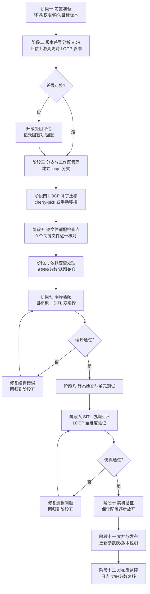

# PX4 LOCP 安全机制——版本升级标准化适配流程

> **适用对象**: 将自定义 LOCP（Loss-of-Control Protection）安全机制从当前版本适配到更新的 PX4 版本
> **当前基线**: PX4 v1.16.0（分支 `locp`）
> **已确认可升级目标**: v1.17.0（正式版）、v1.18.0-beta1
> **文档日期**: 2026-08-03

---

## 目录

1. [适配流程总览](#1-适配流程总览)
2. [阶段一：前置准备](#2-阶段一前置准备)
3. [阶段二：版本差异分析 (VDR)](#3-阶段二版本差异分析-vdr)
4. [阶段三：分支与工作区管理](#4-阶段三分支与工作区管理)
5. [阶段四：LOCP 补丁迁移](#5-阶段四locp-补丁迁移)
6. [阶段五：逐文件适配检查点](#6-阶段五逐文件适配检查点)
7. [阶段六：依赖变更处理](#7-阶段六依赖变更处理)
8. [阶段七：编译适配](#8-阶段七编译适配)
9. [阶段八：静态检查与单元测试](#9-阶段八静态检查与单元测试)
10. [阶段九：SITL 仿真回归](#10-阶段九sitl-仿真回归)
11. [阶段十：实机验证](#11-阶段十实机验证)
12. [阶段十一：文档与发布](#12-阶段十一文档与发布)
13. [风险与回滚预案](#13-风险与回滚预案)
14. [适配检查清单 (Checklist)](#14-适配检查清单-checklist)

---

## 1. 适配流程总览



**核心原则**:
1. **一次只升一个版本**：v1.16.0 → v1.17.0 → v1.18.0，禁止跨版本跳跃
2. **补丁独立化**：LOCP 改动必须与上游版本差异分离，便于追溯
3. **每个阶段都有明确出口标准**：通过后才能进入下一阶段
4. **可回滚**：任何阶段都可回退到上一个稳定版本

---

## 2. 阶段一：前置准备

### 2.1 环境要求确认

| 项目 | 要求 | 检查命令 |
|------|------|----------|
| 磁盘空间 | ≥ 40GB | `df -h` |
| 内存 | ≥ 16GB（推荐 32GB） | `free -h` |
| 工具链 | PX4 v1.17+ 需要更新的工具链 | `bash ./Tools/setup/ubuntu.sh` |
| 编译器 | GCC arm-none-eabi ≥ 10.3 | `arm-none-eabi-gcc --version` |
| Python | ≥ 3.8 | `python3 --version` |
| git | ≥ 2.20 | `git --version` |

> ⚠️ **v1.17+ 工具链警告**: PX4 v1.17 起工具链要求可能升级（如 GCC 版本）。 适配前必须运行 `bash ./Tools/setup/ubuntu.sh` 更新工具链，否则编译可能失败。

### 2.2 确认目标版本

```bash
cd ~/PX4-Autopilot

# 列出所有可用上游版本
git tag --list "v1.*" | sort -V

# 确认目标版本存在
git tag -l "v1.17.0"
# 输出: v1.17.0  ← 确认存在
```

**目标版本选择规则**:
- 优先选 **正式版**（无 alpha/beta/rc 后缀）
- 避免选 alpha/beta 版本用于实机
- 建议适配顺序: v1.16.x → v1.17.0 → v1.18.x

### 2.3 建立适配基线备份

```bash
# 记录当前 LOCP 分支的完整状态（作为适配基线）
git tag locp-v1.16.0-baseline

# 导出 LOCP 补丁（备份，防止后续丢失）
git format-patch v1.16.0 -o ~/px4-locp-backup/ --stdout > ~/px4-locp-backup/locp-against-v1.16.0.patch

# 备份所有 LOCP 相关文件
mkdir -p ~/px4-locp-backup/files
for f in \
  msg/FailsafeFlags.msg \
  src/modules/commander/failure_detector/FailureDetector.hpp \
  src/modules/commander/failure_detector/FailureDetector.cpp \
  src/modules/commander/failure_detector/failure_detector_params.c \
  src/modules/commander/failure_detector/CMakeLists.txt \
  src/modules/commander/Commander.cpp \
  src/modules/commander/failsafe/failsafe.h \
  src/modules/commander/failsafe/failsafe.cpp \
  docs/zh/safety/LOCP-失控保护系统说明文档.md; do
    cp "$f" ~/px4-locp-backup/files/ 2>/dev/null
done

echo "备份完成，文件数: $(ls ~/px4-locp-backup/files/ | wc -l)"
```

---

## 3. 阶段二：版本差异分析 (VDR)

**VDR (Version Difference Review)** 的目的是评估上游版本变更对 LOCP 的影响程度，决定适配策略和风险等级。

### 3.1 上游变更统计（已实测 v1.16.0 → v1.17.0）

```bash
# 关键文件的上游改动规模统计
for f in \
  msg/FailsafeFlags.msg \
  src/modules/commander/failure_detector/FailureDetector.cpp \
  src/modules/commander/failure_detector/FailureDetector.hpp \
  src/modules/commander/failure_detector/failure_detector_params.c \
  src/modules/commander/Commander.cpp \
  src/modules/commander/failsafe/failsafe.cpp \
  src/modules/commander/failsafe/failsafe.h \
  src/modules/commander/failsafe/framework.cpp \
  src/modules/commander/failsafe/framework.h; do
    echo "== $f =="
    git diff --stat v1.16.0 v1.17.0 -- "$f" | tail -1
done
```

**v1.16.0 → v1.17.0 实测结果**:

| 文件 | 上游改动 | 对 LOCP 的影响 | 适配风险 |
|------|----------|---------------|----------|
| `FailureDetector.cpp` | **-124 行**（大幅重构） | **高** — 上游重构了失败检测器 | 🔴 高 |
| `Commander.cpp` | +77 / -44 | 中 — 主循环结构可能变化 | 🟡 中 |
| `failsafe.cpp` | +39 / -42 | 中 — failsafe 状态机调整 | 🟡 中 |
| `failsafe.h` | +12 / -12 | 中 | 🟡 中 |
| `framework.cpp` | +22 / -6 | 低 | 🟢 低 |
| `FailsafeFlags.msg` | +3 / -1 | 低 — 新增/修改标志位 | 🟢 低 |
| `FailureDetector.hpp` | +3 / -18 | 中 | 🟡 中 |
| `failure_detector_params.c` | 无改动 | 低 | 🟢 低 |
| `framework.h` | 无改动 | 低 | 🟢 低 |

### 3.2 详细差异分析步骤

```bash
# 1) 查看上游对 FailureDetector 的具体改动（最重要的分析）
git log v1.16.0..v1.17.0 -- src/modules/commander/failure_detector/ --oneline
git diff v1.16.0 v1.17.0 -- src/modules/commander/failure_detector/FailureDetector.cpp

# 2) 查看 FailsafeFlags.msg 上游新增/修改了哪些字段
git diff v1.16.0 v1.17.0 -- msg/FailsafeFlags.msg

# 3) 查看 Commander 主循环变更
git diff v1.16.0 v1.17.0 -- src/modules/commander/Commander.cpp | grep -E "^[-+].*failure_detector|^[-+].*failsafe_flags|^[-+].*handleModeIntention"
```

### 3.3 影响分析要点（每轮适配必查）

| 检查项 | 说明 | 阻塞性 |
|--------|------|--------|
| **FailureDetector 重构** | 上游是否删除了 LOCP 依赖的函数/成员？LOCP 插入点是否还在？ | 🔴 高 |
| **failsafe_flags 字段变化** | 上游是否新增/重命名了标志位？`CHECK_FAILSAFE` 宏的 `offsetof` 是否受影响？ | 🔴 高 |
| **Action 枚举变化** | 上游是否新增/删除了 Action 类型？会影响优先级排序 | 🔴 高 |
| **checkStateAndMode 结构** | LOCP 插入位置是否仍然有效？ | 🟡 中 |
| **Commander::run() 主循环** | LOCP 标志位同步代码的位置是否变化？ | 🟡 中 |
| **参数注册** | `DEFINE_PARAMETERS` 是否有新的基类参数？ | 🟢 低 |

### 3.4 VDR 输出物

VDR 结束后必须产出三份文件（放入 `docs/zh/safety/upgrade/` 目录）：

```
docs/zh/safety/upgrade/
├── VDR-<target-version>.md        # 差异分析报告
├── UPGRADE-PLAN-<target>.md       # 适配执行计划
└── CONFLICT-LOG-<target>.md       # 冲突与解决记录
```

---

## 4. 阶段三：分支与工作区管理

### 4.1 建立适配分支

```bash
cd ~/PX4-Autopilot

# 确保工作区干净
git status --porcelain

# 拉取上游最新（含所有 tag）
git fetch origin --tags

# 从目标版本 tag 创建适配分支（保证纯上游基线）
git checkout -b locp-v1.17.0 v1.17.0

# 确认分支基线
git log --oneline -1
# 应显示: (v1.17.0) 上游版本

# 更新子模块（版本升级后子模块可能变更）
git submodule update --init --recursive
```

### 4.2 分支命名规范

| 分支 | 用途 |
|------|------|
| `locp` | 原始 LOCP 开发分支（v1.16.0 基线） |
| `locp-v1.17.0` | v1.17.0 适配分支 |
| `locp-v1.18.0` | v1.18.0 适配分支（从 v1.17.0 适配完成后衍生） |
| `locp-main` | 长期维护分支（聚合各版本共性的 LOCP 改动） |

### 4.3 子模块处理

```bash
# 版本升级后检查子模块是否有变化
git diff v1.16.0 v1.17.0 -- .gitmodules

# 如子模块版本有变，必须更新
git submodule update --init --recursive

# 重点子模块：
# - mavlink（MAVLink 定义，影响 OBS 相关消息）
# - NuttX（RTOS，影响编译）
# - PX4-GPSDrivers（GPS 驱动）
# - sitl_gazebo（仿真）
```

---

## 5. 阶段四：LOCP 补丁迁移

LOCP 的所有改动应作为一个**独立补丁**迁移到新版本，与上游差异分离。

### 5.1 方案 A：git cherry-pick（推荐，当 LOCP 改动集中在有限提交时）

```bash
# 在 locp 分支上查看 LOCP 相关的提交
git log v1.16.0..locp --oneline

# 确定 LOCP 提交范围（示例）
# 210f73dfa9 (so3_ladrc)  ← 自定义提交
# 需要识别哪些提交属于 LOCP 功能

# 切换到适配分支
git checkout locp-v1.17.0

# 逐个 cherry-pick LOCP 提交
git cherry-pick <locp-commit-hash>
```

### 5.2 方案 B：手动补丁应用（推荐，LOCP 改动散落在多个提交时）

```bash
# 1) 用之前备份的 patch 文件
cd ~/PX4-Autopilot
git checkout locp-v1.17.0

# 2) 尝试应用补丁
git apply ~/px4-locp-backup/locp-against-v1.16.0.patch

# 3) 如果补丁冲突，用三路合并定位冲突
git apply --3way ~/px4-locp-backup/locp-against-v1.16.0.patch

# 4) 查看冲突文件
git status
```

### 5.3 方案 C：手动移植（最精细，推荐用于高风险文件）

对于 **FailureDetector.cpp** 这类被上游大幅重构的文件，cherry-pick 和 patch 都可能大量冲突。 此时应**手动移植**：

```bash
# 对比新版和旧版的 FailureDetector，人工迁移 LOCP 逻辑
# 步骤：
# 1. 打开 v1.17.0 的 FailureDetector.cpp（全新重构后的版本）
# 2. 打开备份的 v1.16.0 LOCP 版本
# 3. 将 LOCP 的以下部分移植到新版对应位置：
#    - updateLOCP() 函数
#    - checkAttitudeRateAnomaly() / checkVelocityRateAnomaly() 等 6+1 个检测函数
#    - evaluateLOCPSeverity()（含 comm_dead 修复、VRD/PRD 折扣）
#    - checkOffboardSetpointSanity()（OBS）
#    - 内部状态变量和订阅
#    - 参数注册
```

### 5.4 移植冲突处理决策树

```
遇到移植冲突
    │
    ├─ 冲突原因是【上游重构了 LOCP 依赖的函数签名】
    │     → 需理解新 API，改写 LOCP 调用点
    │
    ├─ 冲突原因是【上游新增了功能，改动相邻代码】
    │     → 保持 LOCP 逻辑不变，微调插入位置
    │
    └─ 冲突原因是【上游删除了 LOCP 依赖的消息字段】
          → 高阻塞，需评估是否能用替代数据源
```

---

## 6. 阶段五：逐文件适配检查点

每个文件适配完成后，按以下检查点核对。 这是**最重要的质量关卡**。

### 6.1 `msg/FailsafeFlags.msg`

**检查点**:
- [ ] 上游是否新增了 `failsafe_flags_s` 字段？LOCP 字段（`locp_*`、`crash_detected`）是否仍存在？
- [ ] 上游是否修改了字段顺序？**字段顺序影响 `offsetof` 宏**，`CHECK_FAILSAFE` 依赖它
- [ ] 若上游已定义同名字段，需重命名 LOCP 字段避免冲突

```bash
# 检查上游对该文件的新增字段
git diff v1.16.0 v1.17.0 -- msg/FailsafeFlags.msg
```

### 6.2 `FailureDetector.cpp` / `.hpp`（🔴 高风险，v1.17 有重构）

**检查点**:
- [ ] 上游重构后，`FailureDetector` 类名/构造函数签名是否变化？
- [ ] `update()` 函数签名是否变化？（`Commander.cpp` 调用点需同步）
- [ ] LOCP 的 7 个检测函数 + `updateLOCP()` + `evaluateLOCPSeverity()` 是否完整移植？
- [ ] 内部状态变量（`_ard_hysteresis`、`_sp_pos_prev` 等）是否保留？
- [ ] 订阅（`_trajectory_setpoint_sub`、`_vehicle_local_position_sub` 等）是否仍有效？
- [ ] **comm_dead 修复**是否保留（`count_excl_mto >= 1`）？
- [ ] **VRD/PRD 相关性折扣**是否保留？
- [ ] 参数注册（`_param_locp_*`）是否完整？

### 6.3 `failure_detector_params.c`

**检查点**:
- [ ] 上游是否新增了其他 `FD_*` 参数？是否有参数名冲突？
- [ ] 全部 LOCP 参数（`LOCP_ARD_*`、`LOCP_VRD_*`、`LOCP_PRD_*`、`LOCP_COD_*`、`LOCP_MTO_*`、`LOCP_OBS_*`、`LOCP_L1_ACT/L2_ACT/L3_ACT`、`LOCP_CRASH_THR`）是否完整？
- [ ] 参数默认值是否与 v1.16.0 一致（特别是 `LOCP_L2_ACT=3`、`LOCP_OBS_ACT=3`）？
- [ ] `@group LOCP` 分组注释是否保留（便于 QGC 筛选）？

### 6.4 `Commander.cpp`

**检查点**:
- [ ] `_failure_detector.update(...)` 调用点是否与新版 `FailureDetector::update()` 签名匹配？
- [ ] LOCP 标志位同步代码块是否仍在主循环正确位置（`handleModeIntentionAndFailsafe()` 之后）？
- [ ] `locp_flags.locp_obs_triggered`、`crash_detected` 等同步是否完整？

```bash
# 搜索 LOCP 同步代码是否仍在
grep -n "locp_obs_triggered\|locp_severity\|getLOCP_ARD" src/modules/commander/Commander.cpp
```

### 6.5 `failsafe.cpp` / `failsafe.h`

**检查点**:
- [ ] `fromLOCPActParam()` 是否保留？
- [ ] `locp_failsafe_action` 枚举是否保留？
- [ ] `checkStateAndMode()` 中 LOCP 的 CHECK_FAILSAFE 调用（L1/L2/L3/Crash/OBS）是否完整？
- [ ] `_param_locp_obs_act` 参数是否已注册？
- [ ] 上游 Action 枚举变化后，`fromLOCPActParam` 的返回值是否仍匹配新版枚举？

### 6.6 `framework.cpp` / `framework.h`

**检查点**:
- [ ] `Action` 优先级枚举是否被上游修改（新增/删除）？LOCP 的动作映射是否仍合理？
- [ ] `ClearCondition`、`UserTakeoverAllowed` 是否变化？
- [ ] `CHECK_FAILSAFE` 宏是否仍可用？

### 6.7 新增文件确认

**检查点**:
- [ ] `docs/zh/safety/LOCP-失控保护系统说明文档.md` 已同步到新版本适配
- [ ] 本适配流程文档（VDR/升级计划）已创建

---

## 7. 阶段六：依赖变更处理

### 7.1 uORB 消息兼容性

LOCP 订阅的 uORB 话题在新版本中可能变化：

| LOCP 订阅的话题 | 依赖消息 | v1.17 变化风险 |
|----------------|----------|----------------|
| `vehicle_angular_velocity` | ARD | 需确认字段未变 |
| `vehicle_local_position` | VRD/PRD | 需确认字段未变 |
| `battery_status` | COD | 需确认字段未变 |
| `esc_status` | COD | 需确认字段未变 |
| `telemetry_status` | MTO | 需确认字段未变 |
| `vehicle_command` | MTO | 需确认字段未变 |
| `trajectory_setpoint` | OBS | 🔴 需确认（v1.17 有 TrajectorySetpoint 超时机制） |
| `vehicle_acceleration` | Crash | 需确认字段未变 |

```bash
# 检查上游是否修改了相关 msg 定义
git diff v1.16.0 v1.17.0 -- msg/versioned/TrajectorySetpoint.msg
git diff v1.16.0 v1.17.0 -- msg/VehicleLocalPosition.msg
```

### 7.2 参数兼容性

```bash
# 确认所有 LOCP 参数在新版本编译后存在（可在 SITL 中验证）
# SITL 启动后执行：
param show LOCP
```

### 7.3 API 兼容性

| API | 用途 | v1.17 变化 |
|-----|------|-----------|
| `systemlib::Hysteresis` | 迟滞滤波 | 需确认头文件路径未变 |
| `PX4_ISFINITE` | NaN 检测（OBS） | 需确认宏仍存在 |
| `matrix::Quatf` / `Eulerf` | ARD 姿态计算 | 需确认 |

---

## 8. 阶段七：编译适配

### 8.1 先编译 SITL（快，用于快速验证语法）

```bash
cd ~/PX4-Autopilot

# 清理旧构建产物（版本升级必须 clean）
make clean

# 编译 SITL 目标（最快验证编译错误）
make px4_sitl_default

# 观察编译输出，修复所有错误
```

### 8.2 再编译目标飞控板

```bash
# 编译实际飞控板（以 CUAV 7-Nano 为例）
make cuav_7-nano_default

# 如果有多块板，逐一编译
make px4_fmu-v5_default
make px4_fmu-v6_default
```

### 8.3 常见编译错误处理

| 错误 | 原因 | 解决 |
|------|------|------|
| `failure_detector_status_u` 未定义 | 上游重构了 union | 按新版结构重新定义 |
| `_param_locp_*` 未声明 | 参数未注册 | 检查 `DEFINE_PARAMETERS` |
| `trajectory_setpoint_s` 字段不存在 | 上游改了 msg | 更新 OBS 检测代码 |
| `Hysteresis` 找不到 | 头文件路径变化 | `#include <lib/hysteresis/hysteresis.h>` |
| `Action::Descend` 未定义 | 上游删了枚举 | 更新 `fromLOCPActParam` 映射 |

---

## 9. 阶段八：静态检查与单元测试

### 9.1 静态检查

```bash
# 编译时启用严格告警
make px4_sitl_default 2>&1 | grep -i "warning\|error"

# 使用 Pylance/C++ Lint 检查改动的文件
# 在 VS Code 中打开文件，查看 Problems 面板
```

### 9.2 单元测试

PX4 的 failsafe 框架有单元测试：

```bash
# 运行 failsafe 单元测试
make px4_sitl_default sitl_tests

# 或直接运行特定测试
cd build/px4_sitl_default
ctest -R failsafe
```

> ⚠️ 如果 LOCP 修改了 `failsafe_test.cpp` 依赖的逻辑，需更新测试用例。

### 9.3 逻辑正确性验证（对照真值表）

适配后需手工验证 LOCP 仲裁逻辑真值表（每行验证）：

| 场景 | ARD | VRD | PRD | COD | MTO | OBS | 期望等级 | 期望动作 |
|------|-----|-----|-----|-----|-----|-----|---------|---------|
| 单 IMU 故障 | ✅ | — | — | — | — | — | L1 | Land |
| EKF 发散(纯) | — | ✅ | ✅ | — | — | — | L1(折扣) | Land |
| 电机堵转 | ✅ | — | — | ✅ | — | — | L2 | Land |
| 多电机故障 | ✅ | ✅ | — | — | — | — | L2 | Land |
| 全系统崩溃 | ✅ | ✅ | ✅ | — | — | — | L3 | Disarm |
| 致命组合 | ✅ | — | — | ✅ | +1 | — | L3 | Disarm |
| 仅心跳丢失 | — | — | — | — | ✅ | — | NONE→L1 | Land |
| setpoint异常 | — | — | — | — | — | ✅ | L1+OBS | Land |

---

## 10. 阶段九：SITL 仿真回归

### 10.1 启动 SITL

```bash
# 启动 jMAVSim 仿真（推荐用于快速验证）
make px4_sitl_default jmavsim
```

### 10.2 LOCP 全维度回归测试

| 测试项 | 方法 | 预期结果 |
|--------|------|----------|
| ARD 触发 | 降低 `LOCP_ARD_R_MAX`，剧烈机动 | L1 → Land |
| VRD 触发 | 降低 `LOCP_VRD_AH_MAX` | L1 → Land |
| PRD 触发 | 降低 `LOCP_PRD_ASTD` | L1 → Land |
| COD 触发 | 降低 `LOCP_COD_DELTA_I` | L1 → Land |
| MTO 单触发 | 断开 MAVLink 心跳 | **NONE→L1**（验证 comm_dead 修复） |
| MTO+传感器 | 断心跳 + 触发 VRD | L2 → Land |
| VRD+PRD 折扣 | 同时触发 | L1（验证折扣） |
| OBS 触发 | 发送跳变 setpoint | OBS_ACT → Land |
| Crash 触发 | 降低阈值后撞击 | Disarm |
| 致命组合 | COD+ARD 同时 | L3 → Disarm |

### 10.3 故障注入

```bash
# 使用 MAVLink 故障注入（SITL 支持）
# 在 MAVLink Shell 中：
failure inject --unit=motor --type=off --instance=1

# 或通过 QGC 的 Analyze → MAVLink Console
```

### 10.4 仿真回归记录

每次回归需记录：
- 测试时间、SITL 版本、git commit
- 每个测试项的通过/失败
- 失败时的日志片段

输出到 `docs/zh/safety/upgrade/SITL-REGRESSION-<target>.md`。

---

## 11. 阶段十：实机验证

> ⚠️ **实机验证前必须先完成全部仿真回归**，且遵守当地无人机法规。

### 11.1 首飞保守配置

```bash
# 烧录前将所有动作设为保守值
param set LOCP_L1_ACT 1    # 仅警告
param set LOCP_L2_ACT 1    # 仅警告
param set LOCP_L3_ACT 1    # 仅警告
param set LOCP_OBS_ACT 1   # 仅警告
param set LOCP_CRASH_THR 80  # 调高碰撞阈值，防误触发
```

### 11.2 渐进式验证计划

| 飞行轮次 | 验证内容 | 动作配置 |
|----------|----------|----------|
| 第 1 轮 | 正常起飞/悬停/降落 | 全部 Warn |
| 第 2 轮 | 正常航线飞行 + 位置模式机动 | 全部 Warn |
| 第 3 轮 | 触发单个维度（模拟） | L1=Land，其余 Warn |
| 第 4 轮 | 双维度模拟 | L1=Land, L2=Land |
| 第 5 轮 | 完整默认配置 | 完整 LOCP |

### 11.3 实机日志分析

```bash
# 每轮飞行后下载 .ulg 日志，用 Flight Review 或 PlotJuggler 分析
# 重点检查：
# - failsafe_flags.locp_severity
# - failsafe_flags.locp_*_triggered
# - failsafe_flags.crash_detected
# - 对比飞行视频确认无误报
```

### 11.4 实机验证出口标准

- [ ] 5 轮飞行全部通过
- [ ] 无 LOCP 误报
- [ ] 无通信异常
- [ ] 参数复核无误
- [ ] 日志完整可追溯

---

## 12. 阶段十一：文档与发布

### 12.1 文档同步

| 文档 | 需更新内容 |
|------|-----------|
| `docs/zh/safety/LOCP-失控保护系统说明文档.md` | 版本号、基线版本、变更说明 |
| 新增 `docs/zh/safety/upgrade/VDR-<target>.md` | VDR 差异分析报告 |
| 新增 `docs/zh/safety/upgrade/UPGRADE-PLAN-<target>.md` | 升级执行计划 |
| 新增 `docs/zh/safety/upgrade/CONFLICT-LOG-<target>.md` | 冲突解决记录 |
| 新增 `docs/zh/safety/upgrade/SITL-REGRESSION-<target>.md` | 仿真回归记录 |

### 12.2 发布流程

```bash
# 1) 提交适配改动（分逻辑提交，便于追溯）
git add msg/FailsafeFlags.msg
git commit -m "locp: adapt FailsafeFlags.msg to v1.17.0"

git add src/modules/commander/failure_detector/
git commit -m "locp: port FailureDetector to v1.17.0 (VDR: handle refactor)"

git add src/modules/commander/
git commit -m "locp: adapt Commander/failsafe integration to v1.17.0"

git add docs/
git commit -m "docs: add upgrade artifacts for v1.17.0"

# 2) 打版本标签
git tag -a locp-v1.17.0 -m "LOCP adapted to PX4 v1.17.0"

# 3) 推送
git push origin locp-v1.17.0 --tags
```

### 12.3 版本发布说明模板

```markdown
## LOCP v1.17.0 适配说明

- **基线**: PX4 v1.17.0
- **适配自**: locp-v1.16.0-baseline
- **上游主要变更**: FailureDetector 重构（-124 行）
- **LOCP 适配改动**:
  - FailureDetector.cpp: 移植 7 维度检测逻辑到新版结构
  - Commander.cpp: 同步 LOCP 标志位同步位置
  - ...
- **已验证**: SITL 回归 12 项全通过
- **待验证**: 实机 5 轮飞行
```

---

## 13. 风险与回滚预案

### 13.1 风险登记表

| 风险 | 等级 | 缓解措施 |
|------|------|----------|
| FailureDetector 上游重构导致 LOCP 移植困难 | 🔴 高 | 手动移植 + 单元测试验证 |
| 新版本 Action 枚举变化导致动作映射错误 | 🔴 高 | 核对 framework.h + 真值表 |
| trajectory_setpoint 消息变化影响 OBS | 🟡 中 | 检查 msg 定义 + SITL OBS 测试 |
| 工具链升级引入编译问题 | 🟡 中 | 更新工具链 + clean build |
| 实机行为与仿真不一致 | 🟡 中 | 渐进式实机验证 |

### 13.2 回滚预案

```bash
# 在任何阶段出现问题，可回退到上一稳定版本
cd ~/PX4-Autopilot

# 查看所有 locp 相关分支/tag
git branch -a | grep locp
git tag | grep locp

# 切回稳定版本（如 v1.16.0 的 LOCP）
git checkout locp-v1.16.0-baseline

# 或切回纯上游版本
git checkout v1.16.0

# 完全重建
make clean
```

**回滚触发条件**:
- 适配分支编译失败且 3 小时内无法修复
- SITL 回归出现 2 项以上失败且无法定位
- 实机验证出现 LOCP 误报或异常

---

## 14. 适配检查清单 (Checklist)

### 阶段一：前置准备
- [ ] 环境检查通过（工具链、磁盘、内存）
- [ ] 目标版本 tag 确认存在
- [ ] LOCP 基线备份完成（tag + patch + 文件副本）

### 阶段二：VDR
- [ ] 9 个关键文件的上游差异已统计
- [ ] FailureDetector 重构影响已评估
- [ ] FailsafeFlags.msg 字段变化已确认
- [ ] Action 枚举变化已确认
- [ ] VDR 报告已输出

### 阶段三：分支管理
- [ ] `locp-<target>` 分支已从上游 tag 创建
- [ ] 子模块已更新
- [ ] 工作区干净

### 阶段四：补丁迁移
- [ ] LOCP 补丁已应用（cherry-pick / patch / 手动）
- [ ] 冲突已全部解决并记录
- [ ] 补丁迁移后编译验证

### 阶段五：逐文件检查
- [ ] FailsafeFlags.msg 检查通过
- [ ] FailureDetector.cpp/.hpp 检查通过（含 comm_dead 修复、VRD/PRD 折扣）
- [ ] failure_detector_params.c 检查通过
- [ ] Commander.cpp 检查通过
- [ ] failsafe.cpp/.h 检查通过（含 OBS_ACT）
- [ ] framework.cpp/.h 检查通过

### 阶段六：依赖变更
- [ ] 全部 uORB 消息兼容
- [ ] 全部参数注册
- [ ] API 兼容性确认

### 阶段七：编译
- [ ] SITL 编译通过
- [ ] 目标飞控板编译通过
- [ ] 无未解决的编译错误/告警

### 阶段八：静态检查与单测
- [ ] 无静态检查错误
- [ ] failsafe 单元测试通过
- [ ] 真值表逻辑验证通过

### 阶段九：SITL 回归
- [ ] 12 项 LOCP 回归测试全通过
- [ ] 故障注入测试通过
- [ ] 回归记录已输出

### 阶段十：实机验证
- [ ] 5 轮飞行通过
- [ ] 无 LOCP 误报
- [ ] 日志完整

### 阶段十一：文档与发布
- [ ] 文档已同步
- [ ] 升级产物已提交并打 tag
- [ ] 发布说明已生成

---

## 附录 A：适配过程中的常用命令速查

```bash
# 查看版本差异
git diff v1.16.0 v1.17.0 -- <file>

# 查看指定文件的历史
git log --oneline v1.16.0..v1.17.0 -- <file>

# 查看上游某个提交的详情
git show <commit-hash>

# 三路合并应用补丁
git apply --3way <patch-file>

# 查看冲突
git diff --name-only --diff-filter=U

# 编译 SITL（快速验证）
make px4_sitl_default

# 编译 + 上传
make cuav_7-nano_default upload

# 运行单元测试
cd build/px4_sitl_default && ctest -R failsafe
```

---

> **文档维护者**: LOCP 适配团队
> **更新日期**: 2026-08-03
> **当前基线**: v1.16.0
> **已验证目标**: v1.17.0（VDR 完成）、v1.18.0-beta1（待适配）
